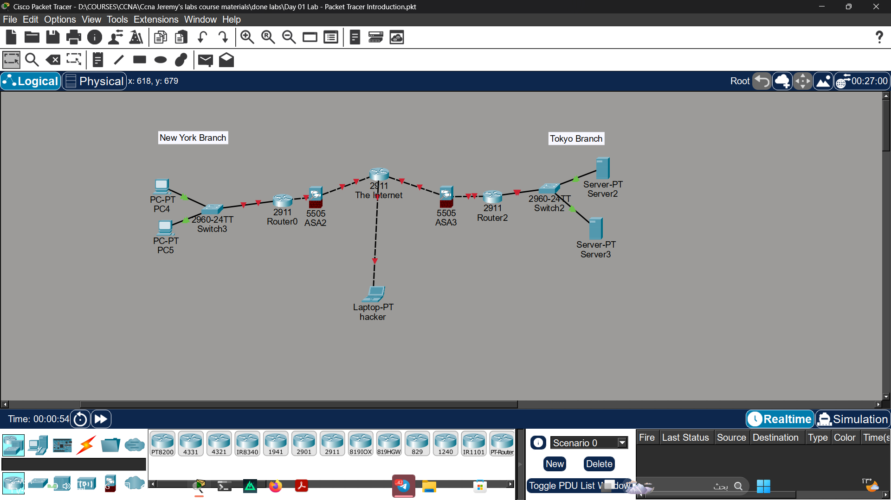

# Lab 01 - Packet Tracer Intro

## Objective
Get familiar with Cisco Packet Tracer interface by recreating 
a network diagram from Jeremy's IT Lab Day 1 video.

## Topology

## Devices Used
- Cisco 2911 Routers x2
- Cisco 2960 Switches x2
- Cisco 5505 Firewalls x2
- PCs x2
- Servers x2
- Laptop (Attacker)

## What I Did
- Recreated the network diagram shown at 16:40 of Day 1 video
- Added all required devices to the workspace
- Connected devices using Packet Tracer's Auto Connection Type

## Status
✅ Completed

## Notes
Part of Jeremy's IT Lab CCNA course - Video 01