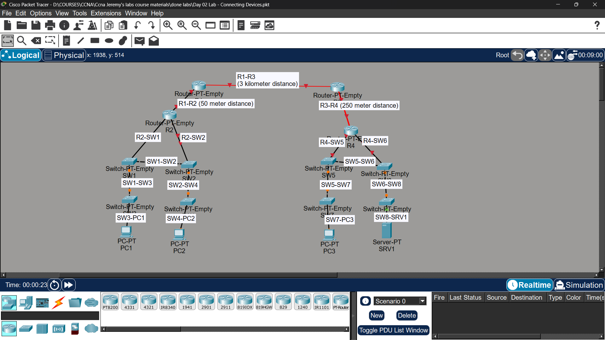

## Objective

 Connect network devices using the correct cable types with Auto MDI-X disabled.
## Topology
 

## Cable Types Used

\- Straight-through cable: PC to Switch, Router to Switch

\- Crossover cable: Switch to Switch, Router to Router

\- Fiber (Single-mode vs Multimode): considered for long/short distance
 \##
## Status
✅ Completed
>>>>>>> 7b9c247f9c0680e1408d8214c78f49a48b121e66

## Notes
Part of Jeremy's IT Lab CCNA course 
