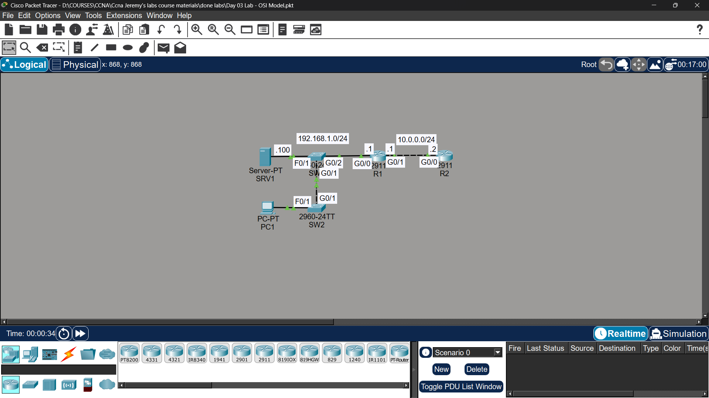

# Lab 03 - OSI Model

## Objective

Analyze network traffic using Packet Tracer simulation mode

and identify OSI model layers in action.

## Topology

## What I Did

\- Used simulation mode to observe traffic across the network

\- Identified which OSI layers were active for each traffic type

\- Released and renewed PC1's IP address to generate Layer 7 traffic

\- Analyzed DHCP traffic through simulation mode

## OSI Layers Observed

\- Layer 7 (Application): DHCP, HTTP

\- Layer 4 (Transport): TCP, UDP

\- Layer 3 (Network): IP

\- Layer 2 (Data Link): Ethernet frames

\- Layer 1 (Physical): Cable signals

## Status

✅ Completed

## Notes

Part of Jeremy's IT Lab CCNA course - Video 03

