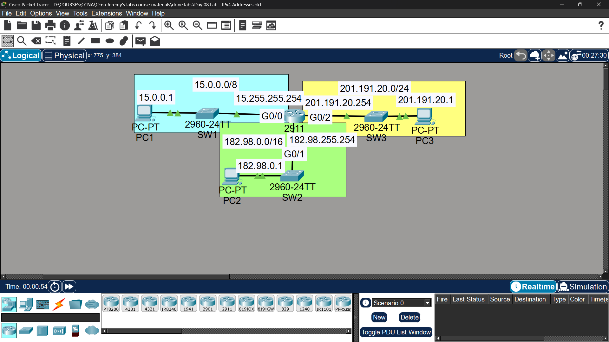

# Lab 06 - IPv4 Addressing & Router Interfaces

## Objective
Configure IP addresses on router interfaces and end devices,
then verify connectivity using ping.

## Topology

## Commands Used

### Basic Setup

Router(config)# hostname R1
R1# show ip interface brief

### Interface Configuration

R1(config)# interface gigabitethernet0/0
R1(config-if)# ip address 192.168.1.1 255.255.255.0
R1(config-if)# description ## LAN1 - Connected to SW1 ##
R1(config-if)# no shutdown

R1(config)# interface gigabitethernet0/1
R1(config-if)# ip address 192.168.2.1 255.255.255.0
R1(config-if)# description ## LAN2 - Connected to SW2 ##
R1(config-if)# no shutdown

### Verification & Save

R1# show ip interface brief
R1# show running-config
R1# copy running-config startup-config

## Key Findings
- Interfaces are shutdown by default on Cisco routers
- 'no shutdown' command is required to enable interfaces
- 'show ip interface brief' shows status and IP of all interfaces

## Connectivity Test
- PC1 ping to PC2: ✅ Success
- PC1 ping to PC3: ✅ Success

## Status
✅ Completed

## Notes
Part of Jeremy's IT Lab CCNA course
