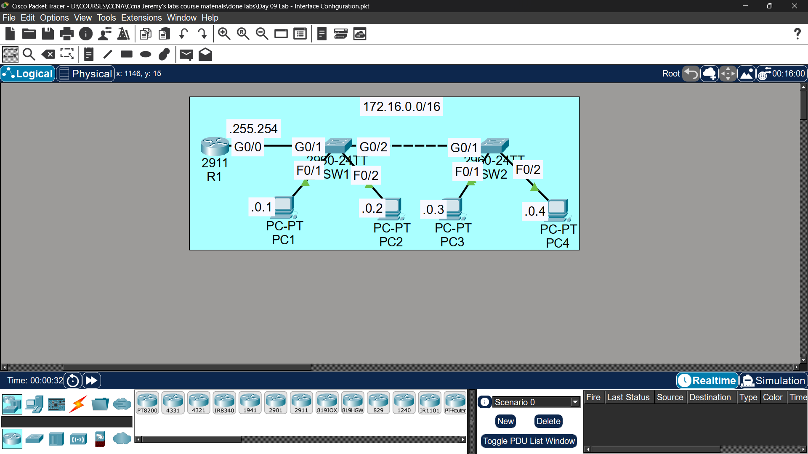

 # Lab 07 - Router & Switch Interfaces

## Objective
Configure interfaces on routers and switches including speed,
duplex, descriptions, and disabling unused interfaces.

## Topology

## Commands Used

### Hostnames
 
Router(config)# hostname R1
Switch(config)# hostname SW1
Switch(config)# hostname SW2
 

### IP Addressing on R1
 
R1(config)# interface gigabitethernet0/0
R1(config-if)# ip address 192.168.1.1 255.255.255.0
R1(config-if)# description ## Connected to SW1 ##
R1(config-if)# no shutdown

### Speed & Duplex on Switch Uplinks
 
SW1(config)# interface gigabitethernet0/1
SW1(config-if)# speed 1000
SW1(config-if)# duplex full
SW1(config-if)# description ## Uplink to R1 ##
SW1(config-if)# no shutdown
 
### Disabling Unused Interfaces
SW1(config)# interface range fastethernet0/3 - 24
SW1(config-if-range)# shutdown
SW1(config-if-range)# description ## Not in use ##
 
### Save Config
SW1# copy running-config startup-config

## Key Concepts Learned
- Speed and duplex should be manually set on links between network devices
- Unused interfaces should be shutdown for security
- 'interface range' command configures multiple interfaces at once

## Status
✅ Completed

## Notes
Part of Jeremy's IT Lab CCNA course