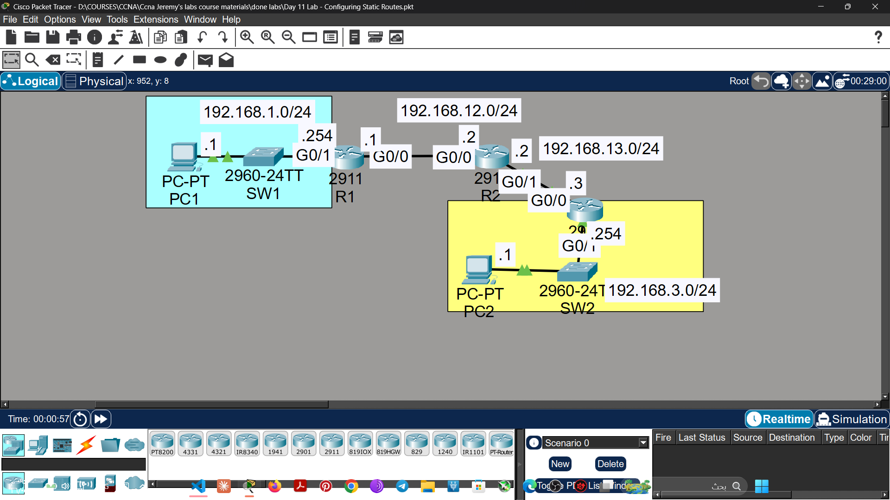

# Lab 08 - Static Routes

## Objective
Configure static routes on routers to enable end-to-end
connectivity between PCs on different networks.

## Topology

## Commands Used

### Basic Configuration
R1(config)# hostname R1
R1(config)# interface gigabitethernet0/0
R1(config-if)# ip address 192.168.1.1 255.255.255.0
R1(config-if)# no shutdown

R1(config)# interface gigabitethernet0/1
R1(config-if)# ip address 192.168.12.1 255.255.255.0
R1(config-if)# no shutdown

### Static Routes on R1
R1(config)# ip route 192.168.2.0 255.255.255.0 192.168.12.2

### Static Routes on R2
R2(config)# ip route 192.168.1.0 255.255.255.0 192.168.12.1

### Verification
R1# show ip route
R1# show ip interface brief
R1# ping 192.168.2.1

## Key Concepts Learned
- Routers only know directly connected networks by default
- Static routes must be configured manually for remote networks
- Both routers need return routes for two-way communication
- Syntax: ip route [destination] [mask] [next-hop]

## Connectivity Test
- PC1 ping to PC2: ✅ Success

## Status
✅ Completed

## Notes
Part of Jeremy's IT Lab CCNA course 