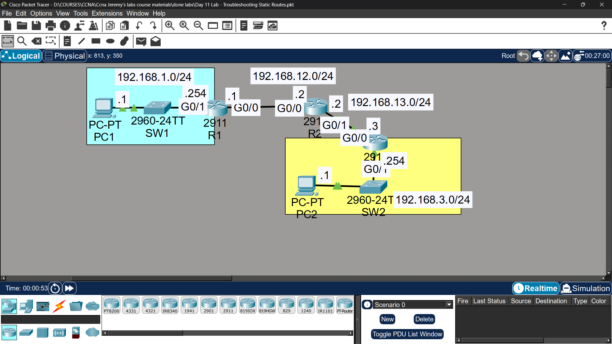

# Lab 09 - Troubleshooting Static Routes

## Objective
Identify and fix misconfigurations on routers to restore
connectivity between PC1 and PC2.

## Topology

## Troubleshooting Process

### Commands Used to Identify Issues
R1# show ip route
R1# show ip interface brief
R1# show running-config
ping 192.168.x.x

### Misconfigurations Found

**R1:**
- Wrong next-hop IP address in static route
- Fix:
R1(config)# no ip route [wrong destination] [mask] [wrong next-hop]
R1(config)# ip route [correct destination] [mask] [correct next-hop]

**R2:**
- Wrong subnet mask in static route
- Fix:
R2(config)# no ip route [wrong destination] [mask] [wrong next-hop]
R2(config)# ip route [correct destination] [correct mask] [correct next-hop]

## Key Concepts Learned
- Always verify routes with 'show ip route'
- Check both directions: R1 needs route to PC2's network, R2 needs route to PC1's network
- Common mistakes: wrong next-hop, wrong subnet mask, wrong destination network

## Connectivity Test
- PC1 ping to PC2: ✅ Success after fixes

## Status
✅ Completed

## Notes
Part of Jeremy's IT Lab CCNA course - Video 09
