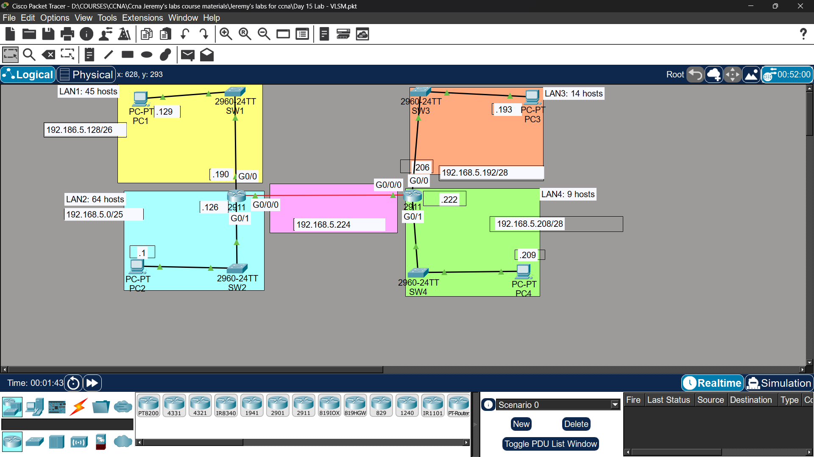

# Lab 10 - VLSM (Variable Length Subnet Masking)

## Objective
Subnet the 192.168.5.0/24 network using VLSM to provide
sufficient addressing for each LAN and point-to-point links.
Configure static routes so all PCs can ping each other.

## Topology

## Network Requirements
| Network | Hosts Needed |
|---------|-------------|
| LAN1 (SW1) | 45 hosts |
| LAN2 (SW2) | 64 hosts |
| LAN3 (SW3) | 14 hosts |
| LAN4 (SW4) | 9 hosts |
| R1-R2 Link | Point-to-point |

## VLSM Subnetting Solution
| Network | Subnet | Mask | First Host | Last Host | Broadcast |
|---------|--------|------|------------|-----------|-----------|
| LAN2 | 192.168.5.0 | /25 | 192.168.5.1 | 192.168.5.126 | 192.168.5.127 |
| LAN1 | 192.168.5.128 | /26 | 192.168.5.129 | 192.168.5.190 | 192.168.5.191 |
| LAN3 | 192.168.5.192 | /28 | 192.168.5.193 | 192.168.5.206 | 192.168.5.207 |
| LAN4 | 192.168.5.208 | /28 | 192.168.5.209 | 192.168.5.222 | 192.168.5.223 |
| R1-R2 | 192.168.5.224 | /30 | 192.168.5.225 | 192.168.5.226 | 192.168.5.227 |

## IP Assignments
| Device | Interface | IP Address |
|--------|-----------|------------|
| PC1 | NIC | 192.168.5.129 |
| PC2 | NIC | 192.168.5.1 |
| PC3 | NIC | 192.168.5.193 |
| PC4 | NIC | 192.168.5.209 |
| R1 G0/0 | LAN1 | 192.168.5.190 |
| R1 G0/1 | LAN2 | 192.168.5.126 |
| R1 G0/0/0 | R1-R2 Link | 192.168.5.225 |
| R2 G0/0/0 | R1-R2 Link | 192.168.5.226 |
| R2 G0/0 | LAN3 | 192.168.5.206 |
| R2 G0/1 | LAN4 | 192.168.5.222 |

## Static Routes Configuration
R1(config)# ip route 192.168.5.192 255.255.255.240 192.168.5.226
R1(config)# ip route 192.168.5.208 255.255.255.240 192.168.5.226

R2(config)# ip route 192.168.5.128 255.255.255.192 192.168.5.225
R2(config)# ip route 192.168.5.0 255.255.255.128 192.168.5.225

## Key Concepts Learned
- VLSM allows efficient use of IP address space
- Assign largest subnet first to avoid overlap
- First usable address goes to PC, last usable to router interface
- /30 subnet is ideal for point-to-point links (2 usable hosts)

## Connectivity Test
- PC1 ping to PC2: ✅ Success
- PC1 ping to PC3: ✅ Success
- PC1 ping to PC4: ✅ Success

## Status
✅ Completed

## Notes
Part of Jeremy's IT Lab CCNA course 