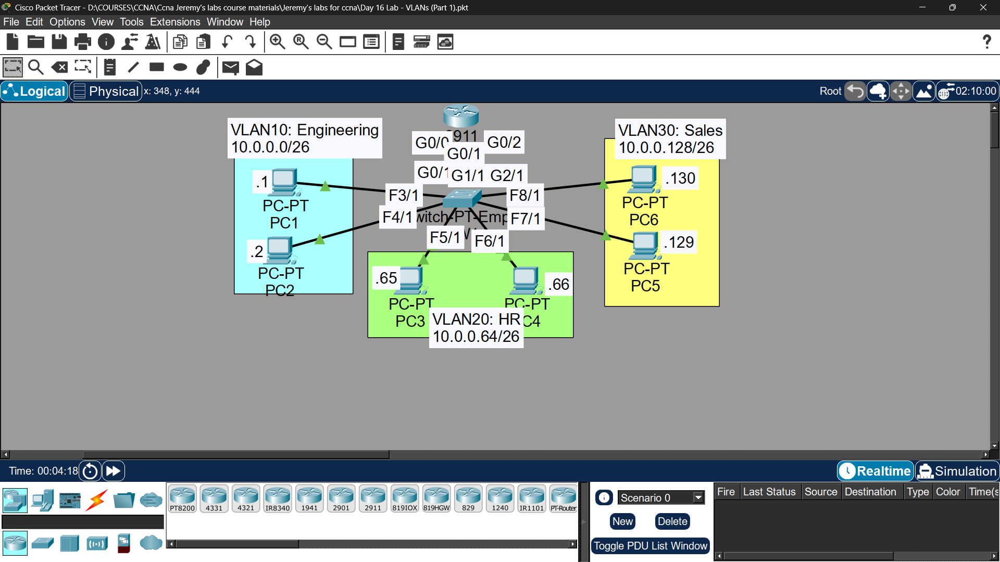

# Lab 11 - VLANs Part 1

## Objective
Configure VLANs on a switch and router to segment network traffic
between Engineering, HR, and Sales departments.

## Topology

## Network Design
| VLAN | Name | Subnet | Gateway |
|------|------|--------|---------|
| VLAN10 | Engineering | 10.0.0.0/26 | 10.0.0.62 |
| VLAN20 | HR | 10.0.0.64/26 | 10.0.0.126 |
| VLAN30 | Sales | 10.0.0.128/26 | 10.0.0.190 |

## IP Assignments
| Device | IP | VLAN |
|--------|-----|------|
| PC1 | 10.0.0.1 | VLAN10 |
| PC2 | 10.0.0.2 | VLAN10 |
| PC3 | 10.0.0.65 | VLAN20 |
| PC4 | 10.0.0.66 | VLAN20 |
| PC5 | 10.0.0.129 | VLAN30 |
| PC6 | 10.0.0.130 | VLAN30 |

## Commands Used

### VLAN Configuration on SW1
SW1(config)# vlan 10
SW1(config-vlan)# name Engineering
SW1(config)# vlan 20
SW1(config-vlan)# name HR
SW1(config)# vlan 30
SW1(config-vlan)# name Sales

SW1(config)# interface fastethernet3/1
SW1(config-if)# switchport mode access
SW1(config-if)# switchport access vlan 10

SW1(config)# interface fastethernet6/1
SW1(config-if)# switchport mode access
SW1(config-if)# switchport access vlan 20

SW1(config)# interface fastethernet8/1
SW1(config-if)# switchport mode access
SW1(config-if)# switchport access vlan 30

SW1(config)# interface gigabitethernet0/0
SW1(config-if)# switchport mode access
SW1(config-if)# switchport access vlan 10

SW1(config)# interface gigabitethernet0/1
SW1(config-if)# switchport mode access
SW1(config-if)# switchport access vlan 20

SW1(config)# interface gigabitethernet0/2
SW1(config-if)# switchport mode access
SW1(config-if)# switchport access vlan 30

### Router Interface Configuratio
R1(config)# interface gigabitethernet0/0
R1(config-if)# ip address 10.0.0.62 255.255.255.192
R1(config-if)# no shutdown

R1(config)# interface gigabitethernet0/1
R1(config-if)# ip address 10.0.0.126 255.255.255.192
R1(config-if)# no shutdown

R1(config)# interface gigabitethernet0/2
R1(config-if)# ip address 10.0.0.190 255.255.255.192
R1(config-if)# no shutdown

## Key Concepts Learned
- VLANs segment network traffic at Layer 2
- Each VLAN is a separate broadcast domain
- Broadcast pings only reach devices in the same VLAN
- Router is needed for inter-VLAN communication
- Gateway = last usable address of each subnet

## Connectivity Test
- PC1 ping to PC2 (same VLAN): ✅ Success
- PC1 ping to PC3 (different VLAN): ✅ Success via R1
- Broadcast ping stays within VLAN: ✅ Verified in Simulation Mode

## Status
✅ Completed

## Notes
Part of Jeremy's IT Lab CCNA course 