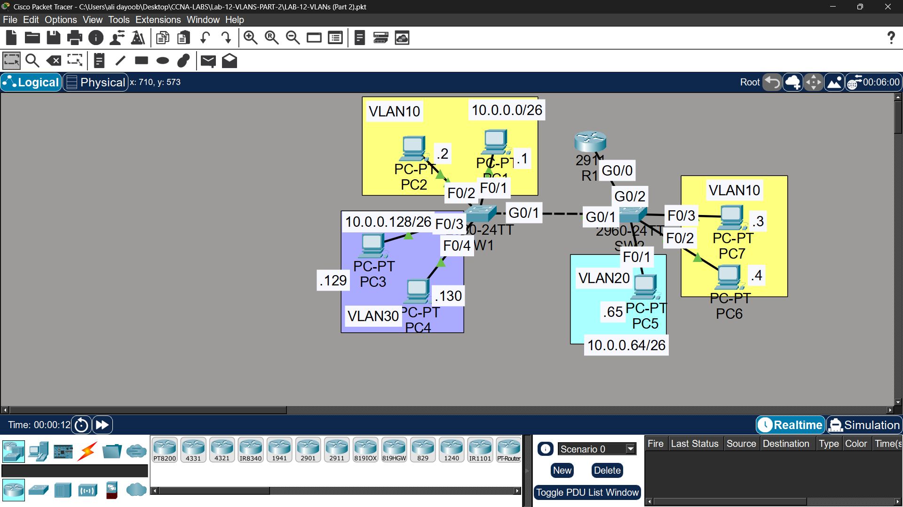

# Lab 12 - VLANs Part 2 (Router on a Stick)

## Objective
Configure inter-VLAN routing using 'Router on a Stick' with trunk
links between switches and subinterfaces on the router.

## Topology

## Network Design
| VLAN | Name | Subnet | Gateway |
|------|------|--------|---------|
| VLAN10 | Engineering | 10.0.0.0/26 | 10.0.0.62 |
| VLAN20 | HR | 10.0.0.64/26 | 10.0.0.126 |
| VLAN30 | Sales | 10.0.0.128/26 | 10.0.0.190 |

## Commands Used

### Access Ports on SW1 & SW2
SW1(config)# interface fastethernet0/1
SW1(config-if)# switchport mode access
SW1(config-if)# switchport access vlan 10

SW2(config)# interface fastethernet0/1
SW2(config-if)# switchport mode access
SW2(config-if)# switchport access vlan 20

### Trunk Link Between SW1 and SW2
SW1(config)# interface gigabitethernet0/1
SW1(config-if)# switchport mode trunk
SW1(config-if)# switchport trunk allowed vlan 10,20,30
SW1(config-if)# switchport trunk native vlan 1001

SW2(config)# interface gigabitethernet0/1
SW2(config-if)# switchport mode trunk
SW2(config-if)# switchport trunk allowed vlan 10,20,30
SW2(config-if)# switchport trunk native vlan 1001

### Router on a Stick (R1 Subinterfaces)
R1(config)# interface gigabitethernet0/0
R1(config-if)# no shutdown

R1(config)# interface gigabitethernet0/0.10
R1(config-subif)# encapsulation dot1q 10
R1(config-subif)# ip address 10.0.0.62 255.255.255.192

R1(config)# interface gigabitethernet0/0.20
R1(config-subif)# encapsulation dot1q 20
R1(config-subif)# ip address 10.0.0.126 255.255.255.192

R1(config)# interface gigabitethernet0/0.30
R1(config-subif)# encapsulation dot1q 30
R1(config-subif)# ip address 10.0.0.190 255.255.255.192

### Verification
SW1# show interfaces trunk
SW1# show vlan brief
R1# show ip interface brief

## Key Concepts Learned
- Trunk links carry traffic for multiple VLANs using 802.1Q tagging
- Native VLAN traffic is untagged - use unused VLAN for security
- Router on a Stick uses subinterfaces for inter-VLAN routing
- Only one physical link needed between switch and router
- All VLANs must exist on both switches for traffic to pass

## Connectivity Test
- PC1 ping to PC2 (same VLAN): ✅ Success
- PC1 ping to PC3 (different VLAN via R1): ✅ Success
- PC1 ping to PC5 (different VLAN via R1): ✅ Success

## Status
✅ Completed

## Notes
Part of Jeremy's IT Lab CCNA course 