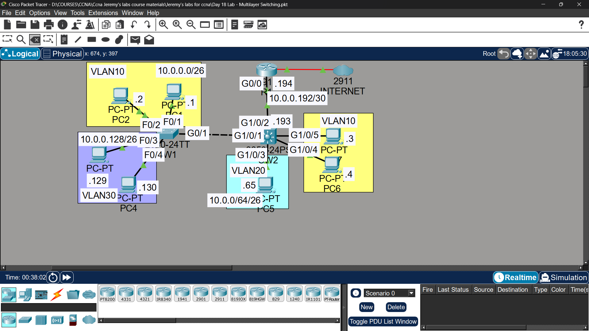

# Lab 13 - Multilayer Switching

## Objective
Replace Router on a Stick with multilayer switching using SVIs
for inter-VLAN routing, and configure a Layer 3 point-to-point
link between SW2 and R1.

## Topology

## Network Design
| VLAN | Name | Subnet | SVI Gateway |
|------|------|--------|-------------|
| VLAN10 | Engineering | 10.0.0.0/26 | 10.0.0.62 |
| VLAN20 | HR | 10.0.0.64/26 | 10.0.0.126 |
| VLAN30 | Sales | 10.0.0.128/26 | 10.0.0.190 |

## Commands Used

### Step 1 - Remove ROAS, Configure L3 Link
R1(config)# interface gigabitethernet0/0
R1(config-if)# no shutdown
R1(config-if)# ip address 10.0.0.193 255.255.255.252

SW2(config)# ip routing
SW2(config)# interface gigabitethernet0/1
SW2(config-if)# no switchport
SW2(config-if)# ip address 10.0.0.194 255.255.255.252

SW2(config)# ip route 0.0.0.0 0.0.0.0 10.0.0.193

### Step 2 - Configure SVIs on SW2
SW2(config)# interface vlan 10
SW2(config-if)# ip address 10.0.0.62 255.255.255.192
SW2(config-if)# no shutdown

SW2(config)# interface vlan 20
SW2(config-if)# ip address 10.0.0.126 255.255.255.192
SW2(config-if)# no shutdown

SW2(config)# interface vlan 30
SW2(config-if)# ip address 10.0.0.190 255.255.255.192
SW2(config-if)# no shutdown

### Verification
SW2# show ip route
SW2# show interfaces vlan 10
SW2# show ip interface brief
## Key Concepts Learned
- Multilayer switches can route between VLANs without a router
- SVIs (Switched Virtual Interfaces) act as default gateways per VLAN
- 'no switchport' converts a switch port to a routed Layer 3 port
- 'ip routing' must be enabled on multilayer switch
- Default route on SW2 sends all unknown traffic to R1

## Connectivity Test
- PC1 ping to PC3 (inter-VLAN via SVI): ✅ Success
- PC1 ping to 1.1.1.1 (Internet): ✅ Success

## Status
✅ Completed

## Notes
Part of Jeremy's IT Lab CCNA course 