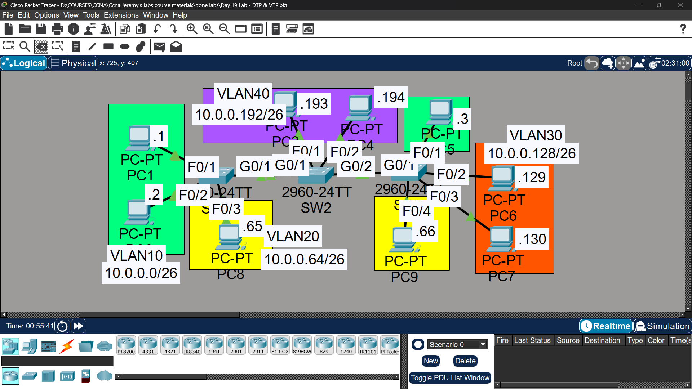

# Lab 14 - DTP & VTP

## Objective
Configure trunk links manually, disable DTP, and understand
how VTP propagates VLAN information across switches in
Server, Transparent, and Client modes.

## Topology

## Commands Used

### Step 1 - Manual Trunk Configuration & Disable DTP
SW1(config)# interface range gigabitethernet0/1-2
SW1(config-if-range)# switchport mode trunk
SW1(config-if-range)# switchport nonegotiate

SW2(config)# interface range gigabitethernet0/1-2
SW2(config-if-range)# switchport mode trunk
SW2(config-if-range)# switchport nonegotiate

SW3(config)# interface gigabitethernet0/1
SW3(config-if)# switchport mode trunk
SW3(config-if)# switchport nonegotiate

### Verification
SW1# show interfaces gigabitethernet0/1 switchport

### Step 2 - VTP Server Mode on SW1
SW1(config)# vtp domain CCNA
SW1(config)# vtp mode server

SW1(config)# vlan 10
SW1(config-vlan)# name Engineering
SW1(config)# vlan 20
SW1(config-vlan)# name HR
SW1(config)# vlan 30
SW1(config-vlan)# name Sales

### Step 3 - VTP Transparent Mode on SW2
SW2(config)# vtp domain CCNA
SW2(config)# vtp mode transparent

SW2(config)# vlan 40
SW2(config-vlan)# name Marketing

### Step 4 - VTP Client Mode on SW3
SW3(config)# vtp domain CCNA
SW3(config)# vtp mode client

SW3(config)# vlan 50

### Step 5 - Access Ports for Hosts
SW1(config)# interface fastethernet0/1
SW1(config-if)# switchport mode access
SW1(config-if)# switchport access vlan 10

### Verification Commands

SW1# show vtp status
SW1# show vlan brief
SW3# show vtp status

## Key Findings

| Question | Answer |
|----------|--------|
| Did SW2/SW3 receive VLANs 10,20,30 from SW1? | ✅ Yes (SW2 received before transparent mode, SW3 via VTP) |
| Is VLAN40 added to SW1/SW3? | ❌ No - transparent mode does not advertise/learn VLANs |
| Was VLAN50 added on SW3? | ❌ No - client mode cannot create VLANs locally |
| Is DTP still enabled after manual access config? | ❌ No - 'switchport nonegotiate' disables DTP regardless of mode |

## Key Concepts Learned
- DTP (Dynamic Trunking Protocol) auto-negotiates trunk links - best practice to disable in production
- VTP Server: can create/modify/delete VLANs, advertises to domain
- VTP Transparent: keeps own VLAN database, forwards VTP ads but doesn't apply them
- VTP Client: cannot create VLANs locally, only receives from server
- All switches must be in the same VTP domain to synchronize

## Status
✅ Completed

## Notes
Part of Jeremy's IT Lab CCNA course 