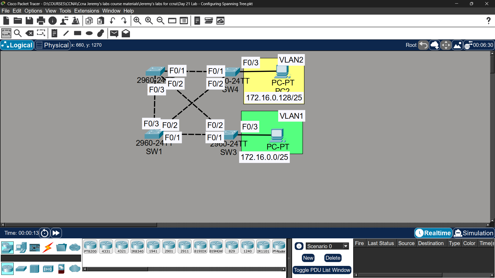

# Lab 15 - Spanning Tree Protocol (STP)

## Objective
Analyze and manipulate STP topology by configuring root bridges,
modifying port costs and priorities, and enabling PortFast/BPDU Guard.

## Topology

## Commands Used

### Step 1 - Verify Current STP Topology
SW1# show spanning-tree
SW1# show spanning-tree vlan 1
SW1# show spanning-tree summary

### Step 2 - Configure Root Bridges
SW1(config)# spanning-tree vlan 1 root primary
SW1(config)# spanning-tree vlan 2 root secondary

SW2(config)# spanning-tree vlan 2 root primary
SW2(config)# spanning-tree vlan 1 root secondary

### Step 3 - Increase SW4 F0/2 Cost
SW4(config)# interface fastethernet0/2
SW4(config-if)# spanning-tree vlan 1 cost 100

### Step 4 - Increase SW1 F0/1 Port Priority
SW1(config)# interface fastethernet0/1
SW1(config-if)# spanning-tree vlan 1 port-priority 240

### Step 5 - PortFast & BPDU Guard
SW3(config)# interface fastethernet0/3
SW3(config-if)# spanning-tree portfast
SW3(config-if)# spanning-tree bpduguard enable

SW4(config)# interface fastethernet0/3
SW4(config-if)# spanning-tree portfast
SW4(config-if)# spanning-tree bpduguard enable

### Verification
SW1# show spanning-tree vlan 1
SW4# show spanning-tree vlan 1 interface fastethernet0/2
SW3# show spanning-tree vlan 1 interface fastethernet0/3

## Key Findings

| Question | Answer |
|----------|--------|
| Original root bridge? | Switch with lowest MAC address (default) |
| Did SW4 change root port after cost increase? | ❌ No - other path cost was still higher |
| Did SW3 change root port after priority change? | ❌ No - lower priority number is preferred, 240 is higher than default 128 |

## STP Port Roles & States After Configuration
| Switch | Port | VLAN1 Role | VLAN2 Role |
|--------|------|------------|------------|
| SW1 | All | Designated | Designated |
| SW2 | Uplink | Root | Designated |
| SW3 | F0/1 | Root | Root |
| SW4 | F0/1 | Root | Root |

## Key Concepts Learned
- Root bridge is elected by lowest Bridge ID (priority + MAC)
- 'root primary' sets priority to 24576, 'root secondary' to 28672
- Lower port cost = preferred path to root bridge
- Lower port priority = preferred (128 default, higher number = less preferred)
- PortFast skips STP listening/learning states for end hosts
- BPDU Guard shuts down PortFast port if BPDU is received (security)

## Status
✅ Completed

## Notes
Part of Jeremy's IT Lab CCNA course 