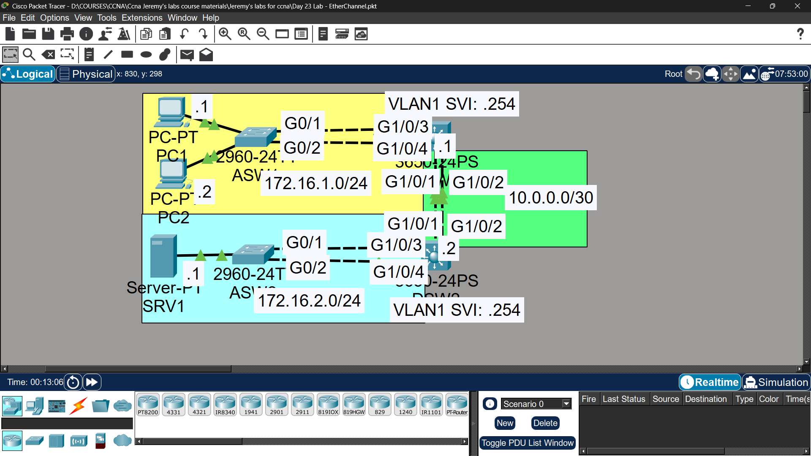

# Lab 16 - EtherChannel

## Objective
Configure Layer 2 and Layer 3 EtherChannels using LACP, PAgP,
and static methods to aggregate links and increase bandwidth.

## Topology

## Commands Used

### Step 1 - L2 EtherChannel ASW1-DSW1 (LACP)
ASW1(config)# interface range fastethernet0/1-2
ASW1(config-if-range)# channel-group 1 mode active
ASW1(config-if-range)# exit
ASW1(config)# interface port-channel 1
ASW1(config-if)# switchport mode trunk

DSW1(config)# interface range fastethernet0/1-2
DSW1(config-if-range)# channel-group 1 mode active
DSW1(config-if-range)# exit
DSW1(config)# interface port-channel 1
DSW1(config-if)# switchport mode trunk

### Step 2 - L2 EtherChannel ASW2-DSW2 (PAgP)
ASW2(config)# interface range fastethernet0/1-2
ASW2(config-if-range)# channel-group 2 mode desirable
ASW2(config-if-range)# exit
ASW2(config)# interface port-channel 2
ASW2(config-if)# switchport mode trunk

DSW2(config)# interface range fastethernet0/1-2
DSW2(config-if-range)# channel-group 2 mode desirable
DSW2(config-if-range)# exit
DSW2(config)# interface port-channel 2
DSW2(config-if)# switchport mode trunk

### Step 3 - L3 EtherChannel DSW1-DSW2 (Static)
DSW1(config)# interface range gigabitethernet1/0/1-2
DSW1(config-if-range)# no switchport
DSW1(config-if-range)# channel-group 3 mode on
DSW1(config-if-range)# exit
DSW1(config)# interface port-channel 3
DSW1(config-if)# ip address 10.0.0.1 255.255.255.252

DSW2(config)# interface range gigabitethernet1/0/1-2
DSW2(config-if-range)# no switchport
DSW2(config-if-range)# channel-group 3 mode on
DSW2(config-if-range)# exit
DSW2(config)# interface port-channel 3
DSW2(config-if)# ip address 10.0.0.2 255.255.255.252

### Step 4 - Routes to SRV1
DSW1(config)# ip routing
DSW1(config)# ip route 0.0.0.0 0.0.0.0 10.0.0.2

DSW2(config)# ip routing
DSW2(config)# ip route 0.0.0.0 0.0.0.0 10.0.0.1

### Verification
DSW1# show etherchannel summary
DSW1# show etherchannel load-balance
DSW1# show interfaces port-channel 1

## Key Findings

| Question | Answer |
|----------|--------|
| Default load-balancing method? | src-mac (source MAC address) |

## EtherChannel Modes Summary
| Protocol | Modes |
|----------|-------|
| LACP | active / passive |
| PAgP | desirable / auto |
| Static | on / on |

## Key Concepts Learned
- EtherChannel bundles multiple physical links into one logical link
- LACP (802.3ad) is open standard - use 'active' on both sides
- PAgP is Cisco proprietary - use 'desirable' on both sides
- Static EtherChannel uses 'on' mode - no negotiation protocol
- L3 EtherChannel requires 'no switchport' before channel-group
- Load balancing distributes traffic across bundled links

## Connectivity Test
- PC1 ping to SRV1: ✅ Success
- PC2 ping to SRV1: ✅ Success

## Status
✅ Completed

## Notes
Part of Jeremy's IT Lab CCNA course
