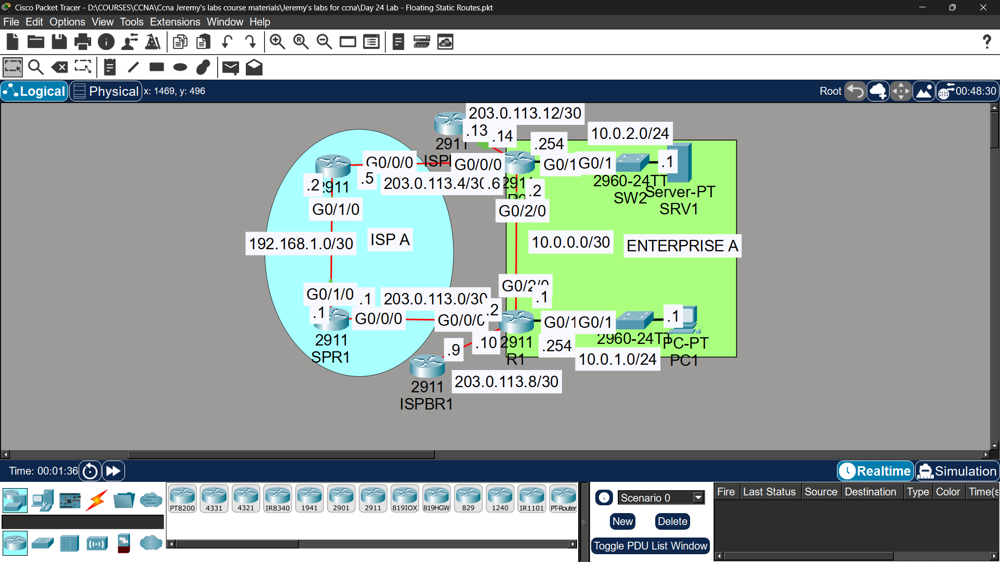

# Lab 17 - Floating Static Routes

## Objective
Analyze existing OSPF routing, then configure floating static
routes as a backup path in case the primary link fails.

## Topology

## Network Design
| Network | Description |
|---------|-------------|
| 203.0.113.0/30 | ISP - ISPBR1 |
| 203.0.113.4/30 | ISPBR1 - R1 |
| 203.0.113.8/30 | ISPBR1 - R2 |
| 203.0.113.12/30 | ISP - R2 |
| 10.0.0.0/30 | R1 - R2 (direct link) |
| 10.0.1.0/24 | PC1 LAN (R2) |
| 10.0.2.0/24 | SRV1 LAN (R1) |

## Investigation - Step 1

| Question | Answer |
|----------|--------|
| Dynamic routing protocol used by Enterprise A? | OSPF - both routes flagged as 'O' with AD = 110 |
| Route used: PC1 to SRV1? | 10.0.2.0/24 [110/2] via 10.0.0.2, GigabitEthernet0/2/0 |
| Route used: PC1 to Internet (1.1.1.1)? | Default route 0.0.0.0/0 [1/0] via 203.0.113.9, R1's .10 interface |

## Commands Used

### Step 2 - Floating Static Routes
R1(config)# ip route 10.0.1.0 255.255.255.0 203.0.113.1 254

R2(config)# ip route 10.0.2.0 255.255.255.0 203.0.113.5 254

### Step 3 - Simulate Link Failure
R1(config)# interface gigabitethernet0/2/0
R1(config-if)# shutdown

### Verification
R1# show ip route
R2# show ip route

## Key Findings

| Question | Answer |
|----------|--------|
| Do floating routes enter the routing table initially? | ❌ No - higher AD (254) than OSPF (110), so OSPF route is preferred |
| Do floating routes enter the table after G0/2/0 is shut down? | ✅ Yes - OSPF route is removed, static route becomes active backup |
| Ping result PC1 to SRV1 after failure? | ✅ Success - traffic now uses the ISP path as backup |

## Key Concepts Learned
- Floating static routes use a higher Administrative Distance (AD) than the dynamic protocol in use
- They only become active when the preferred (lower AD) route disappears from the routing table
- This provides automatic failover without relying solely on dynamic routing convergence
- AD comparison: OSPF (110) < Static Floating Route (254) by default

## Status
✅ Completed

## Notes
Part of Jeremy's IT Lab CCNA course 