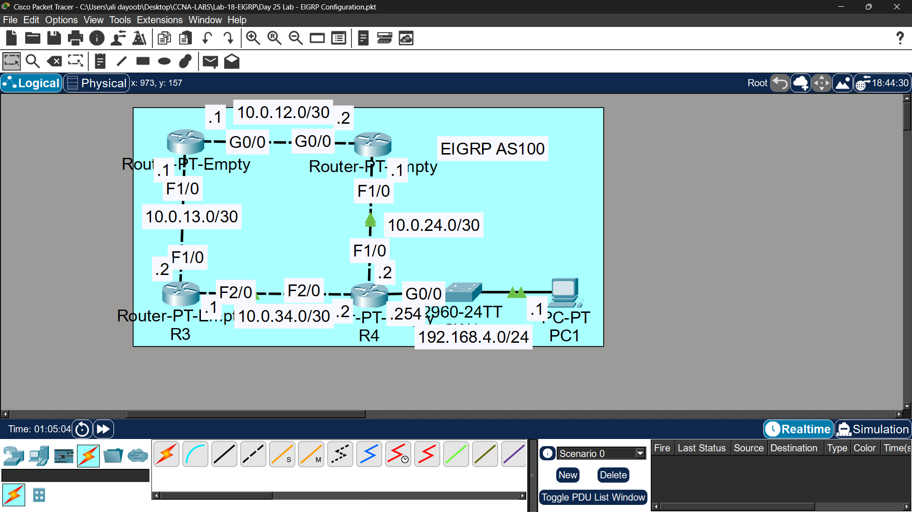

# Lab 18 - EIGRP

## Objective
Configure EIGRP routing protocol on all routers, including
loopback interfaces, passive interfaces, and unequal-cost
load-balancing.

## Topology

## IP Addressing
| Device | Interface | IP Address |
|--------|-----------|------------|
| R1 | G0/0 | 192.168.1.1/24 |
| R1 | G0/1 | 192.168.12.1/30 |
| R1 | G0/2 | 192.168.13.1/30 |
| R1 | Loopback0 | 1.1.1.1/32 |
| R2 | G0/0 | 192.168.12.2/30 |
| R2 | G0/1 | 192.168.24.1/30 |
| R2 | Loopback0 | 2.2.2.2/32 |
| R3 | G0/0 | 192.168.13.2/30 |
| R3 | G0/1 | 192.168.34.1/30 |
| R3 | Loopback0 | 3.3.3.3/32 |
| R4 | G0/0 | 192.168.24.2/30 |
| R4 | G0/1 | 192.168.34.2/30 |
| R4 | G0/2 | 192.168.4.0/24 |
| R4 | Loopback0 | 4.4.4.4/32 |

## Commands Used

### Step 1 & 2 - Basic Config & Loopback
R1(config)# hostname R1
R1(config)# interface gigabitethernet0/0
R1(config-if)# ip address 192.168.1.1 255.255.255.0
R1(config-if)# no shutdown

R1(config)# interface loopback 0
R1(config-if)# ip address 1.1.1.1 255.255.255.255

### Step 3 - EIGRP Configuration
R1(config)# router eigrp 100
R1(config-router)# no auto-summary
R1(config-router)# network 192.168.1.0 0.0.0.255
R1(config-router)# network 192.168.12.0 0.0.0.3
R1(config-router)# network 192.168.13.0 0.0.0.3
R1(config-router)# network 1.1.1.1 0.0.0.0
R1(config-router)# passive-interface gigabitethernet0/0
R1(config-router)# passive-interface loopback 0

### Step 4 - Unequal-Cost Load Balancing (Variance)
R1# show ip eigrp topology
R1(config)# router eigrp 100
R1(config-router)# variance 2

### Verification
R1# show ip eigrp neighbors
R1# show ip eigrp topology
R1# show ip route eigrp
R1# show ip route 192.168.4.0

## Key Concepts Learned
- EIGRP is a Cisco advanced distance-vector protocol
- Loopback interfaces are always up and used as stable Router IDs
- Passive interfaces stop sending EIGRP hellos but still advertise the network
- EIGRP uses Feasible Distance (FD) and Reported Distance (RD) to select routes
- Variance allows unequal-cost load balancing across multiple paths
- Variance multiplier: routes with FD ≤ (best FD × variance) are used

## Connectivity Test
- PC1 ping to PC4: ✅ Success
- Load balancing verified via: show ip route 192.168.4.0

## Status
✅ Completed

## Notes
Part of Jeremy's IT Lab CCNA course 