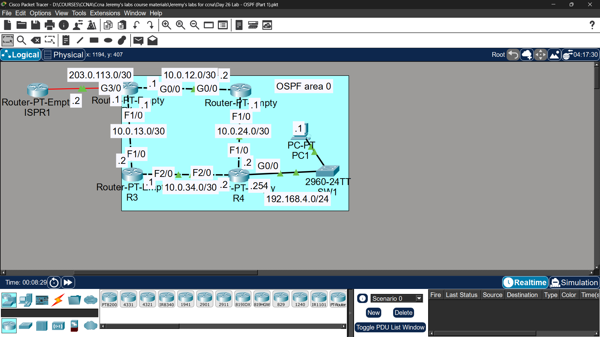

# Lab 19 - OSPF Part 1

## Objective
Configure OSPF routing protocol on all routers, including
loopback interfaces, passive interfaces, and default route
advertisement from an ASBR.

## Topology

## IP Addressing
| Device | Interface | IP Address |
|--------|-----------|------------|
| R1 | G0/0 | 192.168.1.1/24 |
| R1 | G0/1 | 192.168.12.1/30 |
| R1 | G0/2 | 192.168.13.1/30 |
| R1 | Loopback0 | 1.1.1.1/32 |
| R2 | G0/0 | 192.168.12.2/30 |
| R2 | G0/1 | 192.168.24.1/30 |
| R2 | Loopback0 | 2.2.2.2/32 |
| R3 | G0/0 | 192.168.13.2/30 |
| R3 | G0/1 | 192.168.34.1/30 |
| R3 | Loopback0 | 3.3.3.3/32 |
| R4 | G0/0 | 192.168.24.2/30 |
| R4 | G0/1 | 192.168.34.2/30 |
| R4 | G0/2 | 192.168.4.1/24 |
| R4 | Loopback0 | 4.4.4.4/32 |

## Commands Used

### Step 1 & 2 - Basic Config & Loopback
R1(config)# hostname R1
R1(config)# interface gigabitethernet0/0
R1(config-if)# ip address 192.168.1.1 255.255.255.0
R1(config-if)# no shutdown

R1(config)# interface loopback 0
R1(config-if)# ip address 1.1.1.1 255.255.255.255

### Step 3 - OSPF Configuration
R1(config)# router ospf 1
R1(config-router)# network 192.168.1.0 0.0.0.255 area 0
R1(config-router)# network 192.168.12.0 0.0.0.3 area 0
R1(config-router)# network 192.168.13.0 0.0.0.3 area 0
R1(config-router)# network 1.1.1.1 0.0.0.0 area 0
R1(config-router)# passive-interface gigabitethernet0/0
R1(config-router)# passive-interface loopback 0

R2(config)# router ospf 1
R2(config-router)# network 192.168.12.0 0.0.0.3 area 0
R2(config-router)# network 192.168.24.0 0.0.0.3 area 0
R2(config-router)# network 2.2.2.2 0.0.0.0 area 0
R2(config-router)# passive-interface loopback 0

R3(config)# router ospf 1
R3(config-router)# network 192.168.13.0 0.0.0.3 area 0
R3(config-router)# network 192.168.34.0 0.0.0.3 area 0
R3(config-router)# network 3.3.3.3 0.0.0.0 area 0
R3(config-router)# passive-interface loopback 0

R4(config)# router ospf 1
R4(config-router)# network 192.168.24.0 0.0.0.3 area 0
R4(config-router)# network 192.168.34.0 0.0.0.3 area 0
R4(config-router)# network 192.168.4.0 0.0.0.255 area 0
R4(config-router)# network 4.4.4.4 0.0.0.0 area 0
R4(config-router)# passive-interface gigabitethernet0/2
R4(config-router)# passive-interface loopback 0

### Step 4 - R1 as ASBR (Default Route Advertisement)
R1(config)# ip route 0.0.0.0 0.0.0.0 203.0.113.2
R1(config)# router ospf 1
R1(config-router)# default-information originate

### Verification
R1# show ip ospf neighbor
R1# show ip ospf interface
R2# show ip route ospf
R4# show ip route

## Key Findings

| Question | Answer |
|----------|--------|
| Default route added to R2, R3, R4? | ✅ Yes - O*E2 0.0.0.0/0 via R1's interface |
| Route type? | E2 (External Type 2) - cost does not increase across OSPF domain |

## Key Concepts Learned
- OSPF uses 'network' command with wildcard mask to enable on interfaces
- Passive interfaces stop OSPF hellos but still advertise the network
- ASBR (Autonomous System Boundary Router) redistributes external routes into OSPF
- 'default-information originate' advertises default route to all OSPF routers
- OSPF external routes appear as O*E2 in routing table
- Router ID is highest loopback IP by default

## Connectivity Test
- R2 ping to Internet (via R1): ✅ Success
- R4 ping to Internet (via R1): ✅ Success

## Status
✅ Completed

## Notes
Part of Jeremy's IT Lab CCNA course 