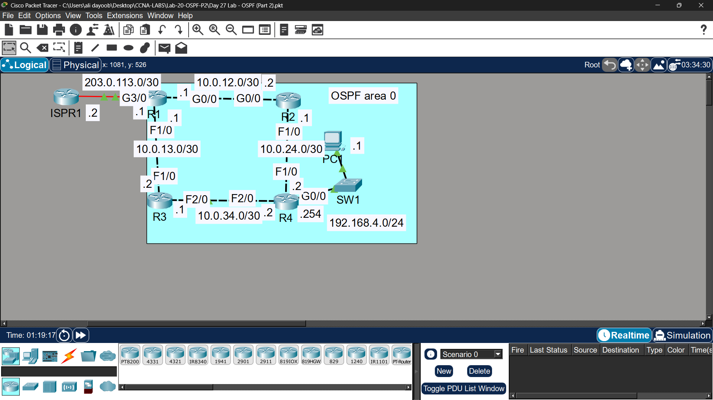
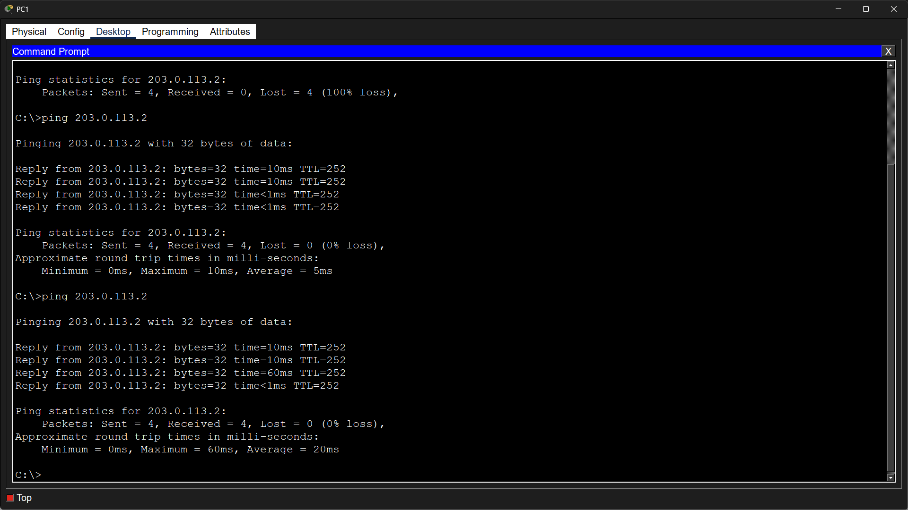

# Lab 20 - OSPF Part 2

## Objective
Configure OSPF using the interface-level method, adjust reference
bandwidth for accurate cost calculation, and analyze OSPF Hello messages.

## Topology

## IP Addressing
| Device | Interface | IP Address |
|--------|-----------|------------|
| R1 | G0/0 | 192.168.1.1/24 |
| R1 | G0/1 | 192.168.12.1/30 |
| R1 | G0/2 | 192.168.13.1/30 |
| R1 | Loopback0 | 1.1.1.1/32 |
| R2 | G0/0 | 192.168.12.2/30 |
| R2 | G0/1 | 192.168.24.1/30 |
| R2 | Loopback0 | 2.2.2.2/32 |
| R3 | G0/0 | 192.168.13.2/30 |
| R3 | G0/1 | 192.168.34.1/30 |
| R3 | Loopback0 | 3.3.3.3/32 |
| R4 | G0/0 | 192.168.24.2/30 |
| R4 | G0/1 | 192.168.34.2/30 |
| R4 | G0/2 | 192.168.4.1/24 |
| R4 | Loopback0 | 4.4.4.4/32 |

## Commands Used

### Step 1 & 2 - Basic Config & Loopback
R1(config)# hostname R1
R1(config)# interface gigabitethernet0/0
R1(config-if)# ip address 192.168.1.1 255.255.255.0
R1(config-if)# no shutdown

R1(config)# interface loopback 0
R1(config-if)# ip address 1.1.1.1 255.255.255.255

### Step 3 - Enable OSPF Directly on Interfaces
R1(config)# router ospf 1
R1(config-router)# passive-interface gigabitethernet0/0
R1(config-router)# passive-interface loopback 0

R1(config)# interface gigabitethernet0/0
R1(config-if)# ip ospf 1 area 0

R1(config)# interface gigabitethernet0/1
R1(config-if)# ip ospf 1 area 0

R1(config)# interface gigabitethernet0/2
R1(config-if)# ip ospf 1 area 0

R1(config)# interface loopback 0
R1(config-if)# ip ospf 1 area 0

### Step 4 - Reference Bandwidth
R1(config)# router ospf 1
R1(config-router)# auto-cost reference-bandwidth 10000

R2(config)# router ospf 1
R2(config-router)# auto-cost reference-bandwidth 10000

R3(config)# router ospf 1
R3(config-router)# auto-cost reference-bandwidth 10000

R4(config)# router ospf 1
R4(config-router)# auto-cost reference-bandwidth 10000

### Step 5 - R1 as ASBR
R1(config)# ip route 0.0.0.0 0.0.0.0 203.0.113.2
R1(config)# router ospf 1
R1(config-router)# default-information originate

### Verification
R4# show ip route
R4# show ip ospf interface gigabitethernet0/0
R1# show ip ospf neighbor

## Key Findings

| Question | Answer |
|----------|--------|
| Default route type in R4's routing table? | O*E2 0.0.0.0/0 via R1 |
| Why E2? | External type 2 - cost stays constant across the OSPF domain |
| Reference bandwidth formula? | Cost = Reference BW / Interface BW (10000 / 100 = 100 for FastEthernet) |

## OSPF Hello Message Fields
| Field | Description |
|-------|-------------|
| Router ID | Unique ID of the sending router |
| Hello Interval | How often hellos are sent (default 10s) |
| Dead Interval | Time before neighbor declared down (default 40s) |
| Neighbors | List of known neighbor Router IDs |
| Area ID | OSPF area of the interface |
| Network Mask | Subnet mask of the interface |
| Router Priority | Used for DR/BDR election |

## Key Concepts Learned
- Interface-level OSPF config: 'ip ospf [process] area [area]' is cleaner than network command
- Default reference bandwidth is 100 Mbps - too low for modern networks
- Setting reference bandwidth to 10000 makes FastEthernet cost = 100, GigabitEthernet cost = 10
- Must configure same reference bandwidth on ALL routers for consistent cost calculation
- OSPF Hello messages are used to discover and maintain neighbor relationships

## Connectivity Test
- PC1 ping to Internet via R1: ✅ Success
- R4 ping to 203.0.113.2: ✅ Success

## Status
✅ Completed

## Notes
Part of Jeremy's IT Lab CCNA course 