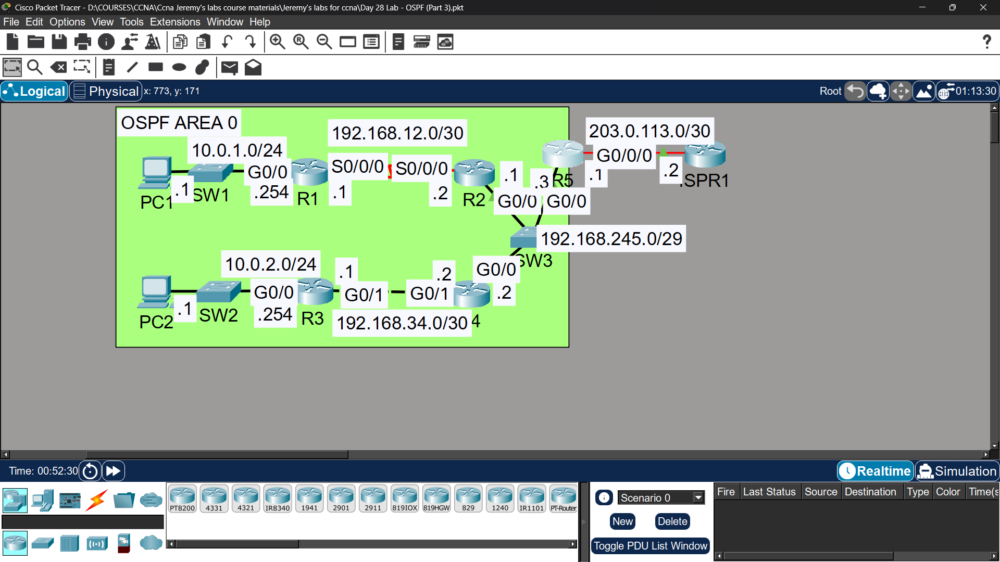
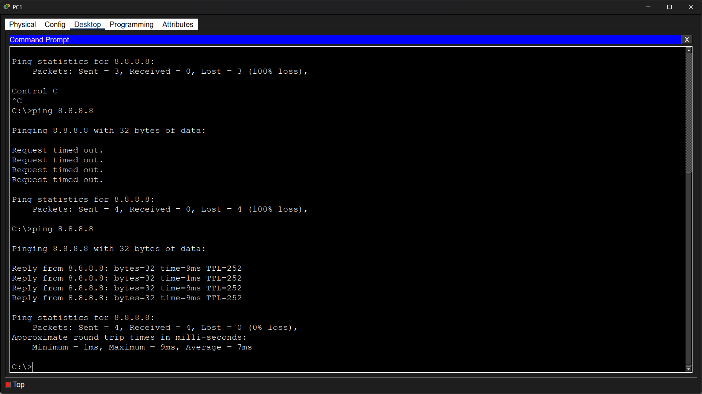
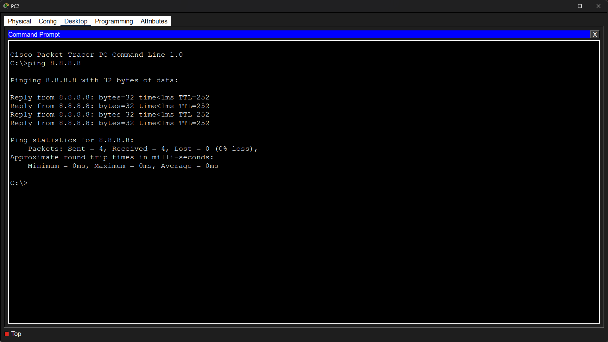

# Lab 21 - OSPF Part 3 (Troubleshooting)

## Objective
Troubleshoot and fix multiple OSPF issues including serial link
configuration, network type mismatch, timer mismatch, and
missing interface configuration.

## Topology

## Commands Used

### Step 1 - Serial Link Configuration
R1(config)# interface serial0/0/0
R1(config-if)# ip address 192.168.12.1 255.255.255.252
R1(config-if)# clock rate 128000
R1(config-if)# no shutdown
R1(config-if)# ip ospf 1 area 0

R2(config)# interface serial0/0/0
R2(config-if)# ip address 192.168.12.2 255.255.255.252
R2(config-if)# no shutdown
R2(config-if)# ip ospf 1 area 0

### Step 2 - Fix OSPF Network Type Mismatch
R3(config)# interface gigabitethernet0/1
R3(config-if)# ip ospf network broadcast

### Step 3 - Fix OSPF Timer Mismatch
R5(config)# interface gigabitethernet0/0
R5(config-if)# ip ospf hello-interval 10
R5(config-if)# ip ospf dead-interval 40

### Step 4 - Fix Missing OSPF Interface Config
R1(config)# interface gigabitethernet0/0
R1(config-if)# ip ospf 1 area 0

R2(config)# interface gigabitethernet0/0
R2(config-if)# ip ospf 1 area 0

### Verification
R3# show ip ospf neighbor
R5# show ip ospf interface gigabitethernet0/0
R1# show ip route ospf
PC1> ping 8.8.8.8

## Troubleshooting Summary

| Problem | Root Cause | Fix |
|---------|-----------|-----|
| R3 only has route to 10.0.2.0/24 | OSPF network type mismatch - R3 G0/1 was point-to-point, R4 G0/1 was broadcast | `ip ospf network broadcast` on R3 G0/1 |
| R2 & R4 won't become neighbors with R5 | OSPF Hello/Dead timer mismatch | Set R5 timers to Hello=10, Dead=40 |
| PC1 & PC2 can't ping 8.8.8.8 | OSPF not configured on R1 & R2 G0/0 interfaces | `ip ospf 1 area 0` on both interfaces |

## Key Concepts Learned
- Serial links require clock rate on the DCE side
- OSPF network type must match on both sides of a link
- Point-to-point vs Broadcast = different DR/BDR election behavior
- Hello and Dead intervals must match for neighbors to form
- Default timers: Hello=10s, Dead=40s on broadcast networks
- All interfaces must be added to OSPF process to advertise their networks

## Connectivity Test
- PC1 ping to 8.8.8.8: ✅ Success

- PC2 ping to 8.8.8.8: ✅ Success

- R2 OSPF neighbor with R5: ✅ Fixed
- R4 OSPF neighbor with R5: ✅ Fixed

## Status
✅ Completed

## Notes
Part of Jeremy's IT Lab CCNA course 