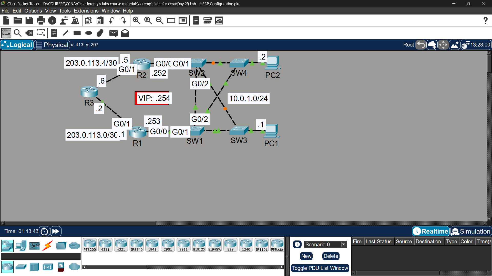

# Lab 22 - HSRP (Hot Standby Router Protocol)

## Objective
Configure HSRPv2 for first-hop redundancy, allowing PC1/PC2
to maintain connectivity even if the active router fails.

## Topology

## Network Design
| Device | Interface | IP Address |
|--------|-----------|------------|
| R1 | G0/0 | 203.0.113.1/30 |
| R1 | G0/1 | 10.0.1.253/24 |
| R2 | G0/0 | 203.0.113.5/30 |
| R2 | G0/1 | 10.0.1.252/24 |
| VIP (HSRP) | - | 10.0.1.254/24 |
| PC1 | NIC | 10.0.1.1/24 |
| PC2 | NIC | 10.0.1.2/24 |

## Commands Used

### Step 2 - Configure HSRPv2 on R1 & R2
R1(config)# interface gigabitethernet0/1
R1(config-if)# standby version 2
R1(config-if)# standby 1 ip 10.0.1.254
R1(config-if)# standby 1 priority 110
R1(config-if)# standby 1 preempt

R2(config)# interface gigabitethernet0/1
R2(config-if)# standby version 2
R2(config-if)# standby 1 ip 10.0.1.254
R2(config-if)# standby 1 priority 90
R2(config-if)# standby 1 preempt

### Verification
R1# show standby
R1# show standby brief

## Key Findings

| Question | Answer |
|----------|--------|
| Default gateway before HSRP? | Either R1 or R2's physical IP (no redundancy) |
| MAC address mapped to VIP? | 0000.0c9f.f001 (HSRPv2 virtual MAC) |
| Is R2 used as gateway when R1 is off? | ✅ Yes - R2 takes over as active router |
| Does R1 become active again after restart? | ✅ Yes - because preempt is enabled and R1 has higher priority |

## Key Concepts Learned
- HSRP provides first-hop redundancy using a Virtual IP (VIP)
- Active router handles traffic, Standby router monitors via hellos
- Higher priority = preferred active router (default is 100)
- Preempt allows a router to reclaim active role after coming back online
- HSRPv2 virtual MAC format: 0000.0c9f.fXXX
- Without HSRP, if the gateway router fails, all hosts lose connectivity

## Connectivity Test
- PC1 ping to 8.8.8.8 (R1 active): ✅ Success
- PC1 ping to 8.8.8.8 (R1 off, R2 active): ✅ Success
- R1 reclaims active role after restart: ✅ Confirmed

## Status
✅ Completed

## Notes
Part of Jeremy's IT Lab CCNA course