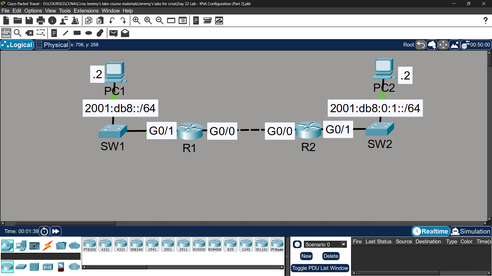

# Lab 23 - IPv6

## Objective
Configure IPv6 addressing using EUI-64, enable IPv6 on interfaces,
and configure static routes for end-to-end IPv6 connectivity.

## Topology

## Network Design
| Device | Interface | IPv6 Address |
|--------|-----------|--------------|
| R1 | G0/1 | 2001:db8::/64 (EUI-64) |
| R2 | G0/1 | 2001:db8:0:1::/64 (EUI-64) |
| R1 | G0/0 | Link-local only (ipv6 enable) |
| R2 | G0/0 | Link-local only (ipv6 enable) |
| PC1 | NIC | 2001:db8::1/64 |
| PC2 | NIC | 2001:db8:0:1::1/64 |

## EUI-64 Calculation

### R1 G0/1
| Step | Value |
|------|-------|
| Original MAC | 0030.f236.4502 |
| Split & insert FFFE | 0030.f2**FF.FE**36.4502 |
| Invert 7th bit | 0**2**30.f2FF.FE36.4502 |
| Final IPv6 | 2001:db8::230:F2FF:FE36:4502 |

### R2 G0/1
| Step | Value |
|------|-------|
| Original MAC | 0001.63b0.b802 |
| Split & insert FFFE | 0001.63**FF.FE**b0.b802 |
| Invert 7th bit | 0**2**01.63FF.FEb0.b802 |
| Final IPv6 | 2001:db8:0:1:201:63FF:FEB0:B802 |

## Commands Used

### Step 1 - EUI-64 Configuration
R1(config)# ipv6 unicast-routing
R1(config)# interface gigabitethernet0/1
R1(config-if)# ipv6 address 2001:db8::/64 eui-64

R2(config)# ipv6 unicast-routing
R2(config)# interface gigabitethernet0/1
R2(config-if)# ipv6 address 2001:db8:0:1::/64 eui-64

### Step 3 - Enable IPv6 Without Address
R1(config)# interface gigabitethernet0/0
R1(config-if)# ipv6 enable

R2(config)# interface gigabitethernet0/0
R2(config-if)# ipv6 enable

### Step 4 - IPv6 Static Routes
R1(config)# ipv6 route 2001:db8:0:1::/64 gigabitethernet0/0 FE80::201:63FF:FEB0:B801
R2(config)# ipv6 route 2001:db8::/64 gigabitethernet0/0 FE80::230:F2FF:FE36:4501

### Verification
R1# show ipv6 interface brief
R1# show ipv6 route
PC1> ping 2001:db8:0:1::1

## Key Concepts Learned
- EUI-64 generates a 64-bit interface ID from a 48-bit MAC address
- EUI-64 process: split MAC in half → insert FFFE → invert 7th bit
- 'ipv6 enable' generates only a link-local address (no global unicast)
- Link-local addresses are used as next-hop for IPv6 static routes on point-to-point links
- 'ipv6 unicast-routing' must be enabled for router to forward IPv6 packets

## Connectivity Test
- PC1 ping to PC2 (IPv6): ✅ Success

## Status
✅ Completed

## Notes
Part of Jeremy's IT Lab CCNA course