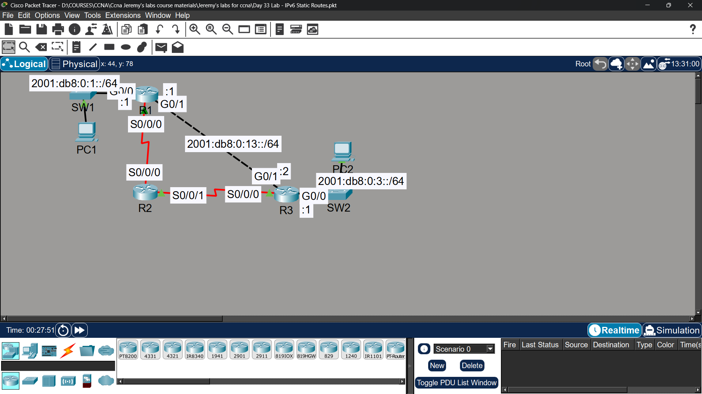

# Lab 24 - IPv6 Static Routes & Floating Static Routes

## Objective
Configure IPv6 static routes and floating static routes to enable
PC1 and PC2 to communicate, with R2 path as backup only.

## Topology

## Commands Used

### Step 1 - Enable IPv6 Routing
R1(config)# ipv6 unicast-routing
R2(config)# ipv6 unicast-routing
R3(config)# ipv6 unicast-routing

### Step 2 - SLAAC on PCs
Set PCs to auto-configure IPv6 (Config → Global → check "Automatic" for IPv6)

### Step 3 - Static Routes (Primary via R1, Backup via R2)

**On R1:**
ipv6 route 2001:db8:0:3::/64 s0/0/0 [R3 link-local] 1
ipv6 route 2001:db8:0:3::/64 s0/0/1 [R2 link-local] 5

**On R3:**
ipv6 route 2001:db8:0:1::/64 s0/0/0 [R1 link-local] 1
ipv6 route 2001:db8:0:1::/64 s0/0/1 [R2 link-local] 5

**On R2:**
ipv6 route 2001:db8:0:1::/64 s0/0/0 [R1 link-local]
ipv6 route 2001:db8:0:3::/64 s0/0/1 [R3 link-local]

### Verification
R1# show ipv6 route
R1# show ipv6 interface brief
PC1> ping 2001:db8:0:3::[SLAAC address]

## Key Findings
| Question | Answer |
|----------|--------|
| PC IPv6 via SLAAC | Auto-generated using router prefix + EUI-64 from MAC |
| Primary path | Via R1 → R3 (AD = 1) |
| Backup path | Via R2 (AD = 5, only active if primary fails) |

## Key Concepts Learned
- SLAAC (Stateless Address Autoconfiguration) uses RA messages from router to generate IPv6 address automatically
- IPv6 floating static routes work same as IPv4 - higher AD = backup route
- Serial links use link-local addresses as next-hop
- 'ipv6 unicast-routing' must be enabled for router to send RA messages and forward IPv6 traffic

## Connectivity Test
- PC1 ping to PC2 (primary path via R1-R3): ✅ Success
- PC1 ping to PC2 (backup path via R2 after primary failure): ✅ Success

## Status
✅ Completed

## Notes
Part of Jeremy's IT Lab CCNA course 