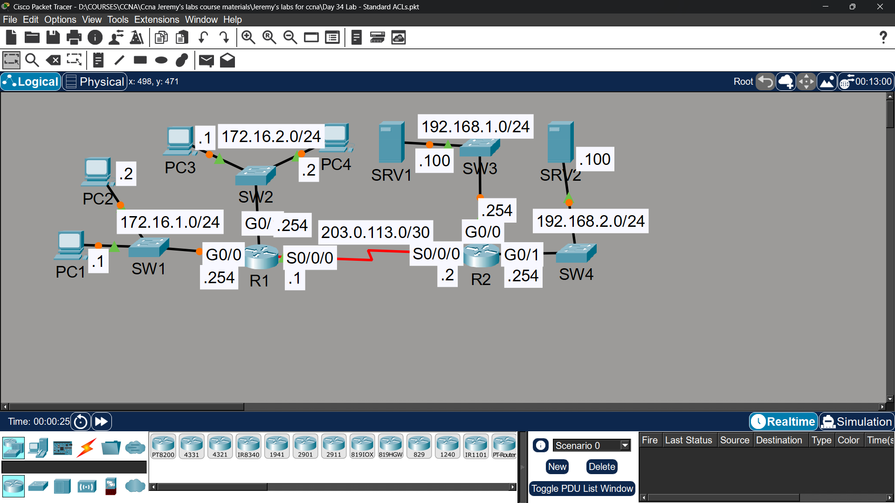
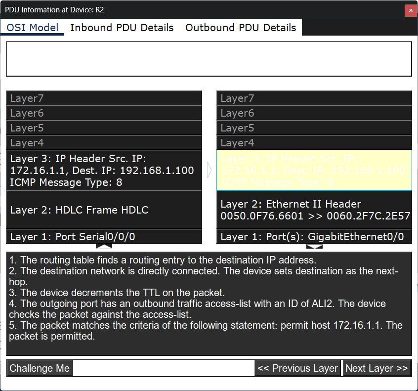
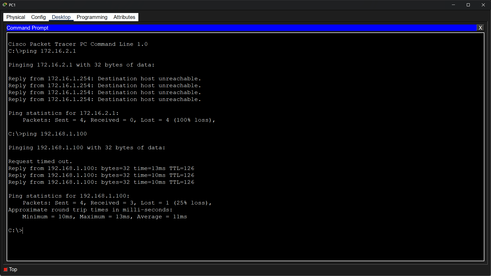
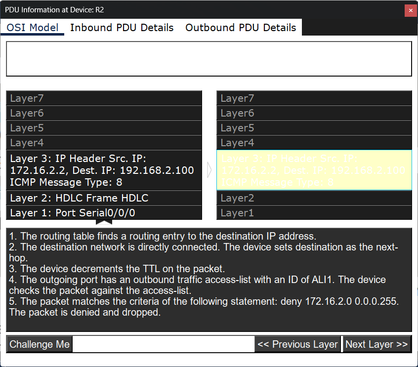
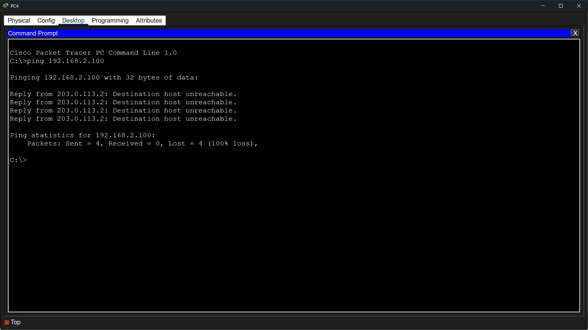
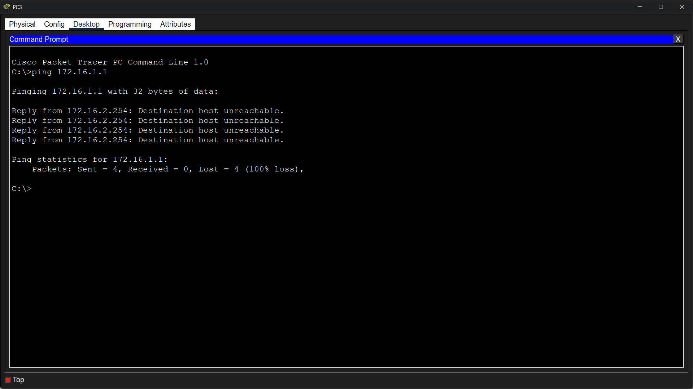

# Lab 25 - Standard ACLs

## Objective
Configure OSPF for full connectivity, then apply standard numbered
and named ACLs on routers to enforce network access policies.

## Topology

## Commands Used

### Step 1 - OSPF Configuration
R1(config)# router ospf 1
R1(config-router)# network 172.16.1.0 0.0.0.255 area 0
R1(config-router)# network 172.16.2.0 0.0.0.255 area 0
R1(config-router)# network 192.168.1.0 0.0.0.255 area 0
R1(config-router)# network 10.0.0.0 0.0.0.3 area 0

R2(config)# router ospf 1
R2(config-router)# network 192.168.1.0 0.0.0.255 area 0
R2(config-router)# network 192.168.2.0 0.0.0.255 area 0
R2(config-router)# network 10.0.0.0 0.0.0.3 area 0

### Step 2 - Standard Numbered ACLs on R1

**Policy: Only PC1 and PC3 can access 192.168.1.0/24**
R1(config)# access-list 1 permit 172.16.1.1
R1(config)# access-list 1 permit 172.16.2.1
R1(config)# interface gigabitethernet0/0
R1(config-if)# ip access-group 1 out

**Policy: Hosts in 172.16.2.0/24 can't access 192.168.2.0/24**
R1(config)# access-list 2 deny 172.16.2.0 0.0.0.255
R1(config)# access-list 2 permit any
R1(config)# interface gigabitethernet0/1
R1(config-if)# ip access-group 2 out

### Step 2 - Standard Named ACLs on R2

**Policy: 172.16.1.0/24 can't access 172.16.2.0/24**
**Policy: 172.16.2.0/24 can't access 172.16.1.0/24**
R2(config)# ip access-list standard BLOCK_172_CROSS
R2(config-std-nacl)# deny 172.16.1.0 0.0.0.255
R2(config-std-nacl)# deny 172.16.2.0 0.0.0.255
R2(config-std-nacl)# permit any

R2(config)# interface gigabitethernet0/0
R2(config-if)# ip access-group BLOCK_172_CROSS out

R2(config)# interface gigabitethernet0/1
R2(config-if)# ip access-group BLOCK_172_CROSS out

### Verification
R1# show access-lists
R1# show ip interface gigabitethernet0/0
R2# show access-lists

## Key Concepts Learned
- Standard ACLs filter based on SOURCE IP address only
- Standard ACLs should be applied as CLOSE TO THE DESTINATION as possible
- Numbered ACLs: access-list [1-99] permit/deny
- Named ACLs: ip access-list standard [name]
- Implicit deny at end of every ACL blocks all unmatched traffic
- 'permit any' must be added explicitly if other traffic should pass

## Connectivity Test
- PC1 ping to SRV1 (192.168.1.0): ✅ Permitted

- PC3 ping to SRV1 (192.168.1.0): ✅ Permitted

- PC2 ping to SRV1 (192.168.1.0): ❌ Blocked by ACL 1

- 172.16.2.0 ping to 192.168.2.0: ❌ Blocked by ACL 2

- 172.16.1.0 ping to 172.16.2.0: ❌ Blocked by BLOCK_172_CROSS
- 172.16.2.0 ping to 172.16.1.0: ❌ Blocked by BLOCK_172_CROSS

## Status
✅ Completed

## Notes
Part of Jeremy's IT Lab CCNA course 