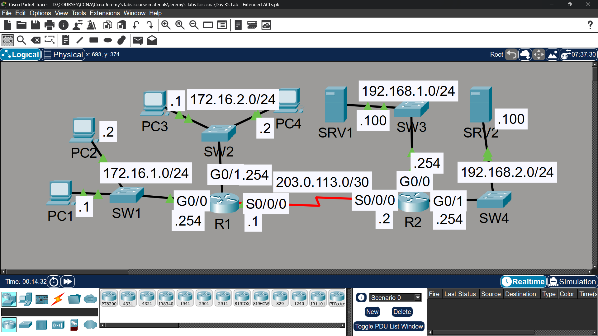
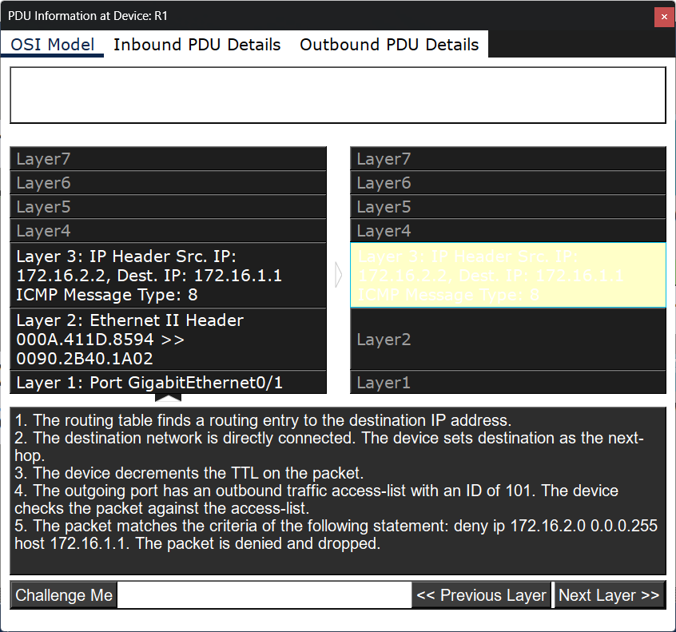
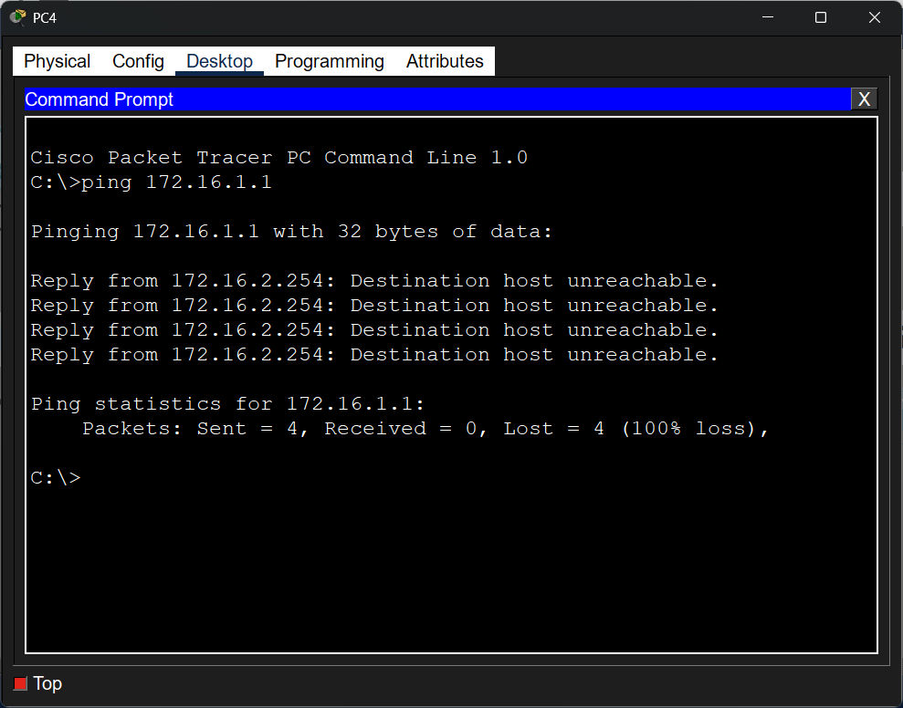
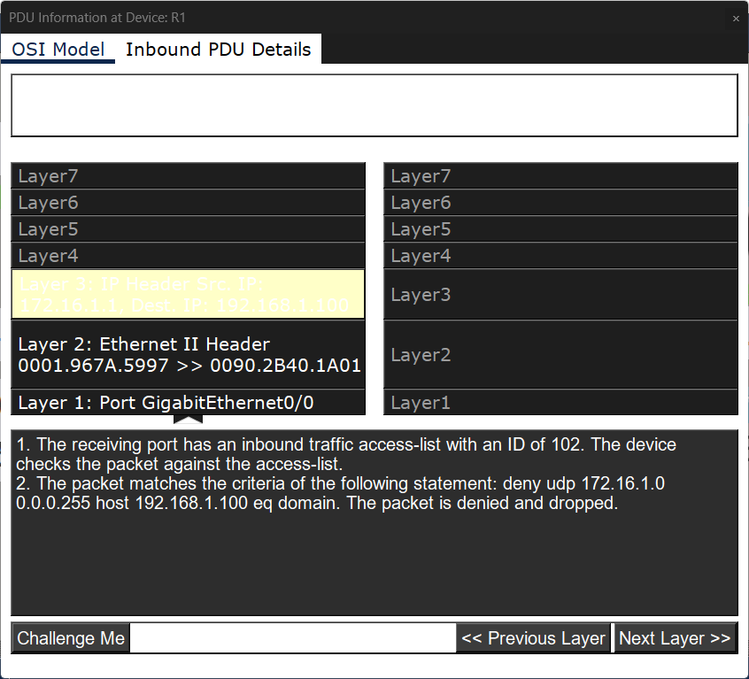

# Lab 26 - Extended ACLs

## Objective
Configure extended ACLs to enforce specific network policies
based on source IP, destination IP, and service/port.

## Topology

## Network Design
| Network | Description |
|---------|-------------|
| 172.16.1.0/24 | PC1, PC2 (SW1) |
| 172.16.2.0/24 | PC3, PC4 (SW2) |
| 192.168.1.0/24 | SRV1 |
| 192.168.2.0/24 | SRV2 |
| 203.0.113.0/30 | R1-R2 Serial Link |

## Commands Used

### Policy 1 - 172.16.2.0/24 can't communicate with PC1
Applied on R1 G0/1 inbound (close to source):
R1(config)# ip access-list extended BLOCK_PC1
R1(config-ext-nacl)# deny ip 172.16.2.0 0.0.0.255 host 172.16.1.1
R1(config-ext-nacl)# permit ip any any
R1(config)# interface gigabitethernet0/1
R1(config-if)# ip access-group BLOCK_PC1 in

### Policy 2 - 172.16.1.0/24 can't access DNS on SRV1
Applied on R1 G0/0 inbound (close to source):
R1(config)# ip access-list extended BLOCK_DNS
R1(config-ext-nacl)# deny udp 172.16.1.0 0.0.0.255 host 192.168.1.100 eq 53
R1(config-ext-nacl)# deny tcp 172.16.1.0 0.0.0.255 host 192.168.1.100 eq 53
R1(config-ext-nacl)# permit ip any any
R1(config)# interface gigabitethernet0/0
R1(config-if)# ip access-group BLOCK_DNS in

### Policy 3 - 172.16.2.0/24 can't access HTTP/HTTPS on SRV2
Applied on R1 G0/1 inbound (close to source):
R1(config)# ip access-list extended BLOCK_HTTP
R1(config-ext-nacl)# deny tcp 172.16.2.0 0.0.0.255 host 192.168.2.100 eq 80
R1(config-ext-nacl)# deny tcp 172.16.2.0 0.0.0.255 host 192.168.2.100 eq 443
R1(config-ext-nacl)# permit ip any any
R1(config)# interface gigabitethernet0/1
R1(config-if)# ip access-group BLOCK_HTTP in

### Verification
R1# show access-lists
R1# show ip interface gigabitethernet0/0
R1# show ip interface gigabitethernet0/1

## Key Concepts Learned
- Extended ACLs filter on source IP, destination IP, protocol, and port
- Extended ACLs should be applied as CLOSE TO THE SOURCE as possible
- DNS uses both UDP and TCP port 53 - must deny both
- HTTP = TCP port 80, HTTPS = TCP port 443
- 'permit ip any any' must be added to avoid implicit deny blocking all traffic
- Extended ACL syntax: permit/deny [protocol] [src] [dst] eq [port]

## Connectivity Test
- 172.16.2.0 ping to PC1: ❌ Blocked by BLOCK_PC1

- 172.16.1.0 DNS to SRV1: ❌ Blocked by BLOCK_DNS

- 172.16.1.0 ping to SRV1: ✅ Permitted (only DNS blocked)

- 172.16.2.0 HTTP/HTTPS to SRV2: ❌ Blocked by BLOCK_HTTP
- 172.16.2.0 ping to SRV2: ✅ Permitted (only HTTP/HTTPS blocked)

## Status
✅ Completed

## Notes
Part of Jeremy's IT Lab CCNA course