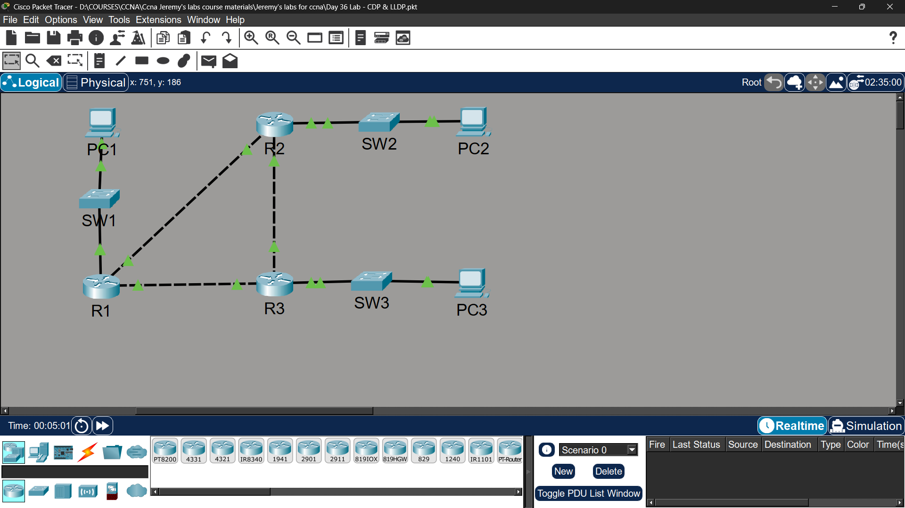

# Lab 27 - CDP & LLDP

## Objective
Use CDP to discover and map unknown network devices and interfaces,
then replace CDP with LLDP for network discovery.

## Topology

## Step 1 - Network Discovery via CDP

### CDP Output on R1
| Device | Local Interface | Remote Interface |
|--------|----------------|-----------------|
| R2 | G0/1 | G0/0 |
| SW1 | G0/2 | G0/1 |
| R3 | G0/0 | G0/1 |

### CDP Output on R3
| Device | Local Interface | Remote Interface |
|--------|----------------|-----------------|
| R2 | G0/2 | G0/2 |
| R1 | G0/1 | G0/0 |
| SW3 | G0/0 | G0/1 |

### Commands Used for Discovery
R1# show cdp neighbors
R1# show cdp neighbors detail
R1# show cdp entry R2

## Step 2 - Disable CDP on Host-Connected Interfaces
SW1(config)# interface fastethernet0/1
SW1(config-if)# no cdp enable

SW3(config)# interface fastethernet0/1
SW3(config-if)# no cdp enable

## Step 3 - Disable CDP Globally
R1(config)# no cdp run
R2(config)# no cdp run
R3(config)# no cdp run
SW1(config)# no cdp run
SW3(config)# no cdp run

## Step 4 - Enable LLDP Globally & Configure Interfaces
R1(config)# lldp run
R1(config)# interface gigabitethernet0/0
R1(config-if)# lldp transmit
R1(config-if)# lldp receive
R1(config)# interface gigabitethernet0/1
R1(config-if)# lldp transmit
R1(config-if)# lldp receive
R1(config)# interface gigabitethernet0/2
R1(config-if)# lldp transmit
R1(config-if)# lldp receive

SW1(config)# lldp run
SW1(config)# interface gigabitethernet0/1
SW1(config-if)# lldp transmit
SW1(config-if)# lldp receive

### Verification
R1# show lldp neighbors
R1# show lldp neighbors detail
R1# show cdp neighbors

## Key Concepts Learned
- CDP (Cisco Discovery Protocol) is Cisco proprietary - Layer 2
- LLDP (Link Layer Discovery Protocol) is open standard (IEEE 802.1AB)
- CDP is enabled globally and per-interface by default on Cisco devices
- LLDP Tx/Rx must be enabled manually per interface
- CDP/LLDP should be disabled on host-facing ports for security
- 'show cdp neighbors detail' reveals IP addresses of neighbors
- CDP/LLDP operate at Layer 2 - work even without IP configuration

## Status
✅ Completed

## Notes
Part of Jeremy's IT Lab CCNA course 