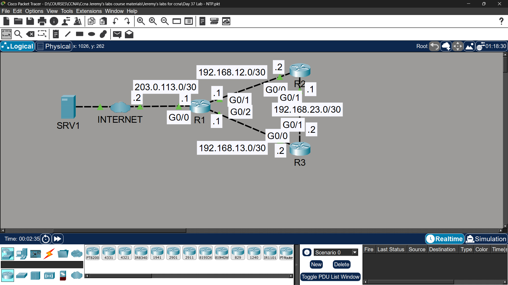

# Lab 28 - NTP (Network Time Protocol)

## Objective
Configure and synchronize clocks across routers using NTP,
with R1 as NTP master and authenticated synchronization to R2/R3.

## Topology

## Commands Used

### Step 1 - Set Software Clock
R1# clock set 12:00:00 30 DEC 2020
R2# clock set 12:00:00 30 DEC 2020
R3# clock set 12:00:00 30 DEC 2020

### Step 2 - Configure Timezone
R1(config)# clock timezone UTC 0
R2(config)# clock timezone UTC 0
R3(config)# clock timezone UTC 0

### Step 3 - R1 Synchronize to Internet NTP Server
R1(config)# ntp server 1.1.1.1

### Step 4 - R1 as NTP Master with Authentication
R1(config)# ntp master
R1(config)# ntp authenticate
R1(config)# ntp authentication-key 1 md5 ALI
R1(config)# ntp trusted-key 1
R1(config)# ntp update-calendar

**R2 & R3 as NTP Clients:**
R2(config)# ntp authenticate
R2(config)# ntp authentication-key 1 md5 ALI
R2(config)# ntp trusted-key 1
R2(config)# ntp server 192.168.12.1 key 1
R2(config)# ntp update-calendar

R3(config)# ntp authenticate
R3(config)# ntp authentication-key 1 md5 ALI
R3(config)# ntp trusted-key 1
R3(config)# ntp server 192.168.13.1 key 1
R3(config)# ntp update-calendar

### Verification
R1# show clock detail
R1# show ntp status
R1# show ntp associations
R2# show ntp status
R2# show ntp associations

## Key Findings

| Question | Answer |
|----------|--------|
| Stratum of 1.1.1.1? | 1 (Primary Server - syncs to atomic/GPS clock) |
| Stratum of R1? | 2 (Secondary Server - syncs to stratum 1) |
| Stratum of R2/R3? | 3 (sync to R1 which is stratum 2) |
| Time source after NTP sync? | NTP (replaces "user configuration") |

## Key Concepts Learned
- NTP synchronizes clocks across network devices automatically
- Stratum indicates distance from reference clock (lower = more accurate)
- Stratum 1 = directly connected to atomic/GPS clock
- 'ntp master' makes router an NTP server even without upstream sync
- NTP authentication prevents synchronizing to rogue NTP servers
- 'ntp update-calendar' syncs software clock to hardware calendar
- Accurate time is critical for logging, certificates, and troubleshooting

## Status
✅ Completed

## Notes
Part of Jeremy's IT Lab CCNA course.