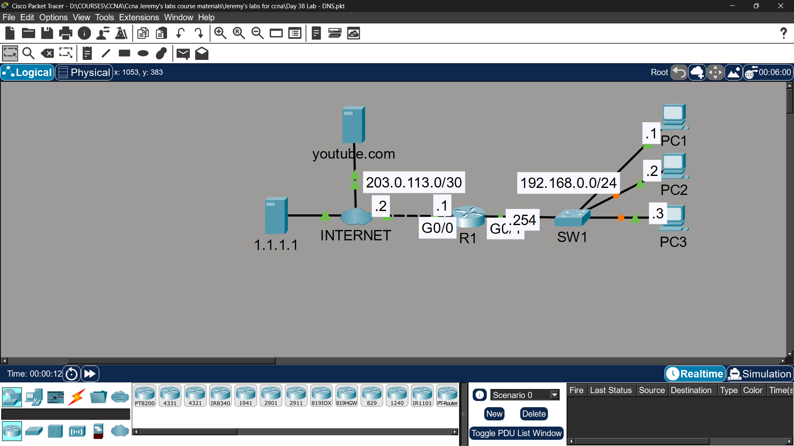

# Lab 29 - DNS

## Objective
Configure DNS settings on routers and PCs, create static host
entries, and analyze DNS resolution process in simulation mode.

## Topology

## Commands Used

### Step 1 - Default Route on R1
R1(config)# ip route 0.0.0.0 0.0.0.0 [ISP next-hop]

### Step 2 - DNS on PCs
Configure via Packet Tracer GUI:
- PC1/PC2/PC3 → Desktop → IP Configuration → DNS Server: **1.1.1.1**

### Step 3 - DNS & Host Entries on R1
R1(config)# ip name-server 1.1.1.1
R1(config)# ip domain-lookup

R1(config)# ip host R1 192.168.1.254
R1(config)# ip host PC1 192.168.1.1
R1(config)# ip host PC2 192.168.2.1
R1(config)# ip host PC3 192.168.3.1

### Verification
R1# ping PC1
R1# show hosts

## DNS Resolution Analysis (Simulation Mode)

| Step | Message | Description |
|------|---------|-------------|
| 1 | DNS Query | PC1 sends UDP packet to 1.1.1.1 asking for youtube.com IP |
| 2 | DNS Reply | 1.1.1.1 responds with youtube.com's IP address |
| 3 | ICMP Echo | PC1 sends ping to the resolved IP address |
| 4 | ICMP Reply | youtube.com responds to the ping |

## Key Concepts Learned
- DNS resolves human-readable names to IP addresses
- 'ip name-server' configures DNS server on Cisco router
- 'ip host' creates static local host entries (like /etc/hosts)
- Static host entries take priority over DNS queries
- DNS uses UDP port 53 for queries, TCP port 53 for large responses
- 'ip domain-lookup' enables DNS on router (enabled by default)

## Connectivity Test
- R1 ping PC1 by name: ✅ Success
- PC1 ping youtube.com: ✅ Success (DNS resolved first)

## Status
✅ Completed

## Notes
Part of Jeremy's IT Lab CCNA course 