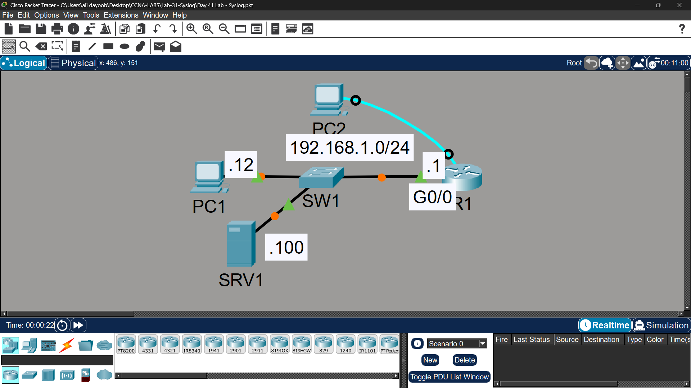
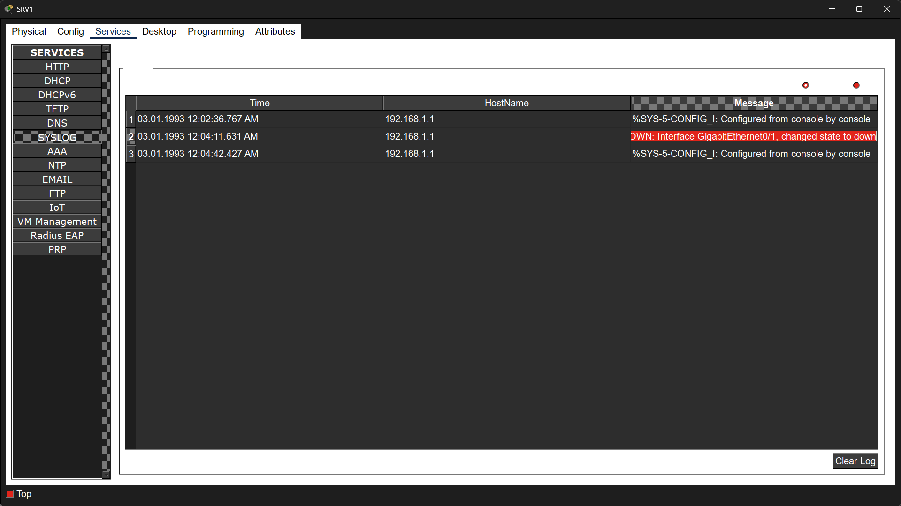

# Lab 31 - Syslog

## Objective
Configure and analyze syslog messages using console and VTY access,
enable timestamps, buffered logging, and remote syslog server logging.

## Topology

## Access Credentials
Username: jeremy
Password: ccna
Enable Password: ccna

## Commands Used

### Step 1 - Console Access & Interface Test
R1(config)# interface gigabitethernet0/0
R1(config-if)# shutdown
R1(config-if)# no shutdown

**Syslog message received:**
%LINEPROTO-5-UPDOWN: Line protocol on Interface GigabitEthernet0/0, changed state to up

**Enable timestamps:**
R1(config)# service timestamps log datetime msec

### Step 2 - Telnet Access & VTY Logging
R1(config)# interface gigabitethernet0/1
R1(config-if)# no shutdown

**Enable logging on current VTY session:**
R1# terminal monitor

### Step 3 - Buffered Logging
R1(config)# logging buffered 8192

### Step 4 - Remote Syslog Server
R1(config)# logging 192.168.1.100
R1(config)# logging trap debugging

### Verification
R1# show logging
R1# show logging | include severity

## Key Findings

| Question | Answer |
|----------|--------|
| Severity level of UPDOWN message? | 5 - Notification |
| Why no syslog message on Telnet/VTY session? | Log messages aren't displayed on VTY lines by default (console only) |
| How to fix it? | `terminal monitor` enables logging display for the current VTY session |

## Syslog Severity Levels
| Level | Name | Description |
|-------|------|-------------|
| 0 | Emergency | System unusable |
| 1 | Alert | Immediate action needed |
| 2 | Critical | Critical condition |
| 3 | Error | Error condition |
| 4 | Warning | Warning condition |
| 5 | Notification | Normal but significant |
| 6 | Informational | Informational message |
| 7 | Debugging | Debug-level message |

## Key Concepts Learned
- Console line receives syslog messages by default; VTY lines do not
- 'terminal monitor' enables syslog display for the current Telnet/SSH session only (not persistent)
- Buffered logging stores messages in router RAM, viewable with 'show logging'
- Remote syslog server centralizes logs from multiple devices
- 'logging trap [level]' sets the minimum severity sent to the syslog server
- Timestamps help correlate events across multiple devices during troubleshooting

## Status
✅ Completed

## Notes
Part of Jeremy's IT Lab CCNA course 