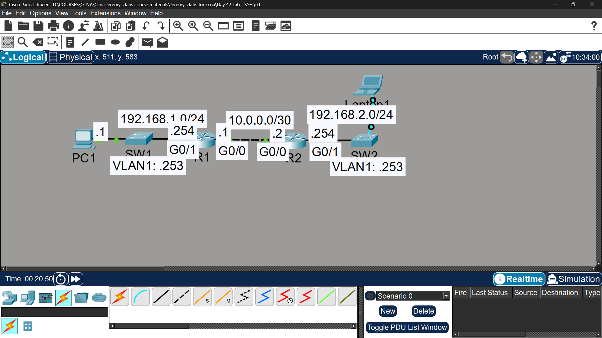
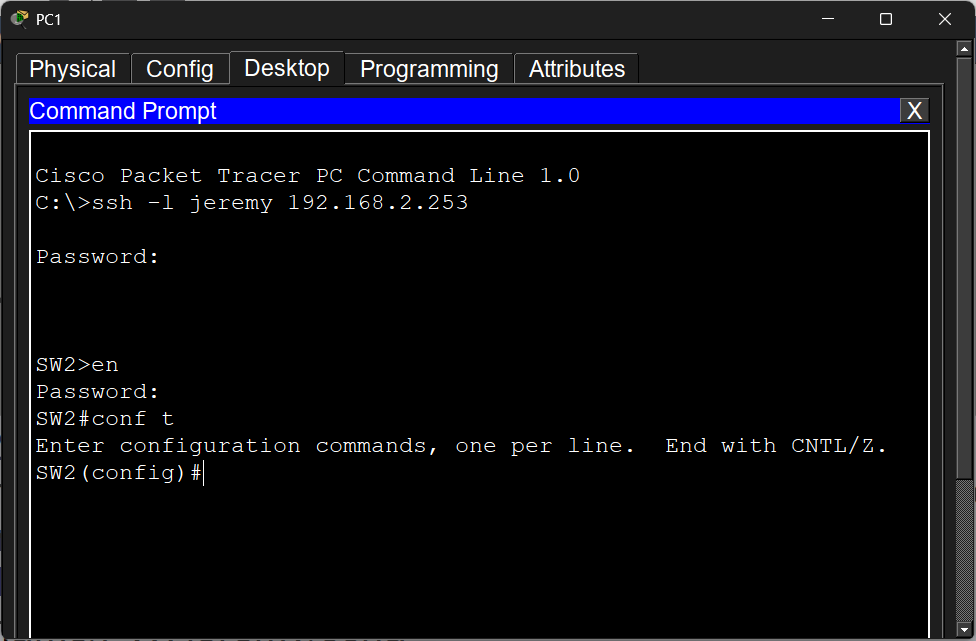

# Lab 32 - SSH

## Objective
Configure a newly added switch with basic security settings and
enable secure remote management via SSH, restricted to a single host.

## Topology

## Commands Used

### Step 1 - Basic Configuration on SW2
Switch(config)# hostname SW2
SW2(config)# enable secret ccna
SW2(config)# username jeremy secret ccna

SW2(config)# interface vlan 1
SW2(config-if)# ip address 192.168.2.253 255.255.255.0
SW2(config-if)# no shutdown

SW2(config)# ip default-gateway 192.168.2.1

### Step 2 - Console Line Security
SW2(config)# line console 0
SW2(config-line)# login local
SW2(config-line)# exec-timeout 5 0

### Step 3 - SSH Configuration
SW2(config)# ip domain-name jeremysitlab.com
SW2(config)# crypto key generate rsa general-keys modulus 2048

SW2(config)# access-list 1 permit 192.168.1.1

SW2(config)# line vty 0 15
SW2(config-line)# login local
SW2(config-line)# transport input ssh
SW2(config-line)# access-class 1 in
SW2(config-line)# exec-timeout 5 0

### Verification
SW2# show ip ssh
SW2# show access-lists
PC1> ssh -l jeremy 192.168.2.253

## Key Concepts Learned
- SSH requires a hostname, domain name, and RSA key before it can be enabled
- 'crypto key generate rsa' with modulus 2048+ is required for SSH version 2
- 'login local' authenticates using locally configured usernames
- 'transport input ssh' disables Telnet, allowing only SSH on VTY lines
- Standard ACL + 'access-class' restricts which hosts can establish VTY sessions
- 'exec-timeout' automatically disconnects idle sessions for security
- Console line security is separate from VTY (remote) line security

## Connectivity Test
- PC1 SSH to SW2: ✅ Success (allowed by ACL)
- Other hosts SSH to SW2: ❌ Blocked by access-class 1

## Status
✅ Completed

## Notes
Part of Jeremy's IT Lab CCNA course 