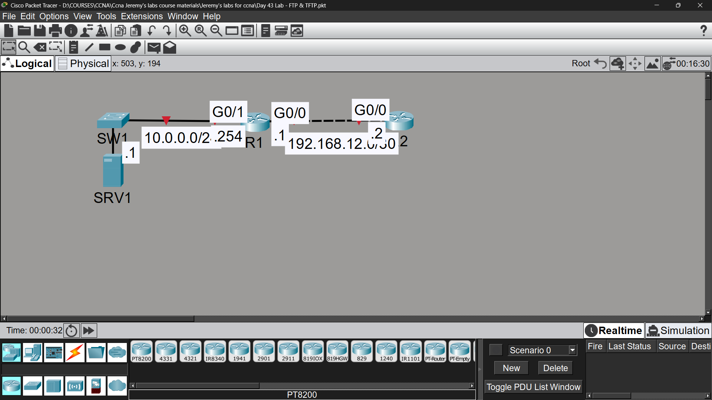

# Lab 33 - TFTP & FTP

## Objective
Configure basic connectivity via OSPF, then use TFTP and FTP to
transfer and upgrade the router IOS image from a server.

## Topology

## Commands Used

### Step 1 - IP Addressing & OSPF Routing
R1(config)# interface gigabitethernet0/0
R1(config-if)# ip address 192.168.12.1 255.255.255.0
R1(config-if)# no shutdown

R1(config)# interface gigabitethernet0/1
R1(config-if)# ip address 10.0.0.254 255.255.255.0
R1(config-if)# no shutdown

R2(config)# interface gigabitethernet0/0
R2(config-if)# ip address 192.168.12.2 255.255.255.0
R2(config-if)# no shutdown

**DHCP Pool for SRV1:**
R1(config)# ip dhcp pool POOL1
R1(dhcp-config)# network 10.0.0.0 255.255.255.0
R1(dhcp-config)# default-router 10.0.0.254

**OSPF Configuration:**
R1(config)# router ospf 1
R1(config-router)# network 10.0.0.0 0.0.0.255 area 0
R1(config-router)# network 192.168.12.0 0.0.0.255 area 0
R1(config-router)# passive-interface gigabitethernet0/1

R2(config)# router ospf 1
R2(config-router)# network 192.168.12.0 0.0.0.255 area 0

### Step 2 & 3 - TFTP Transfer & IOS Upgrade on R1
R1# copy tftp: flash:
Address or name of remote host []? 10.0.0.1
Source filename []? c2900-universalk9-mz.SPA.155-3.M4a.bin
Destination filename [c2900-universalk9-mz.SPA.155-3.M4a.bin]?

R1(config)# boot system flash c2900-universalk9-mz.SPA.155-3.M4a.bin
R1(config)# do write
R1(config)# do reload

**Delete old file:**
R1# delete flash:[old-filename]

### Step 4 & 5 - FTP Transfer & IOS Upgrade on R2
R2(config)# ip ftp username jeremy
R2(config)# ip ftp password ccna

R2# copy ftp: flash:
Address or name of remote host []? 10.0.0.1
Source filename []? c2900-universalk9-mz.SPA.155-3.M4a.bin
Destination filename [c2900-universalk9-mz.SPA.155-3.M4a.bin]?

R2(config)# boot system flash c2900-universalk9-mz.SPA.155-3.M4a.bin
R2(config)# do write
R2(config)# do reload

### Verification
R1# show flash
R1# show version
R2# show flash

## Key Concepts Learned
- TFTP (UDP/69) is simple, unauthenticated file transfer - common for IOS backups/upgrades
- FTP (TCP/20-21) supports authentication (username/password) - more secure than TFTP
- 'boot system flash [filename]' tells the router which IOS image to load on next boot
- Old IOS files should be deleted from flash to save space once upgrade is verified
- 'copy tftp: flash:' and 'copy ftp: flash:' both prompt for server IP and filename
- A reload is required for the new boot system command to take effect

## Connectivity Test
- OSPF neighbor adjacency R1-R2: ✅ FULL
- R1 TFTP file transfer: ✅ Success
- R2 FTP file transfer: ✅ Success
- Both routers reloaded with new IOS: ✅ Success

## Status
✅ Completed

## Notes
Part of Jeremy's IT Lab CCNA course 