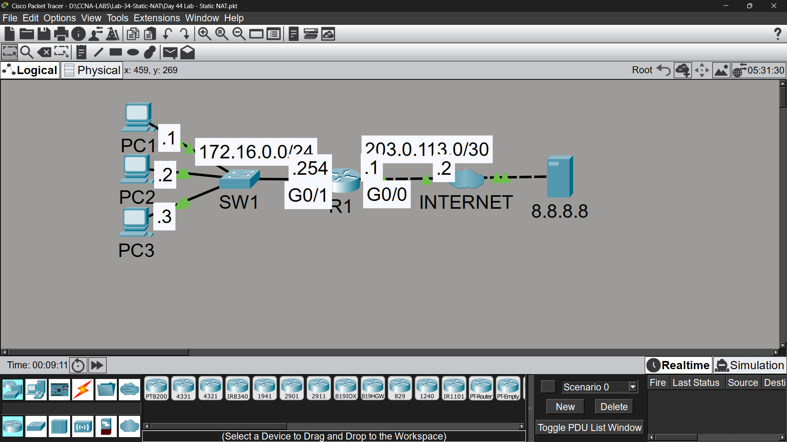

# Lab 34 - Static NAT

## Objective
Configure static NAT to translate private IP addresses to public
IP addresses, enabling Internet connectivity for internal hosts.

## Topology

## Commands Used

### Step 1 - Test Connectivity Before NAT
PC1> ping 8.8.8.8
**Result:** ❌ Failed - Private IPs (172.16.0.0/24) are not routable on the Internet

### Step 2 - Configure Static NAT

**Inside/Outside Interfaces:**
R1(config)# interface gigabitethernet0/0
R1(config-if)# ip nat outside

R1(config)# interface gigabitethernet0/1
R1(config-if)# ip nat inside

**Static NAT Mappings:**
R1(config)# ip nat inside source static 172.16.0.1 100.0.0.1
R1(config)# ip nat inside source static 172.16.0.2 100.0.0.2
R1(config)# ip nat inside source static 172.16.0.3 100.0.0.3

### Verification
R1# show ip nat translations
R1# show ip nat statistics
R1# clear ip nat translation *

## Key Findings

| Question | Answer |
|----------|--------|
| Ping to 8.8.8.8 before NAT? | ❌ Failed - private IP not routable on Internet |
| Ping to 8.8.8.8 after NAT? | ✅ Success - translated to public IP |
| Entries remaining after clearing translations? | Static entries remain permanently - only dynamic translations are cleared |

## Key Concepts Learned
- Private IP ranges (RFC 1918) are not routable across the Internet
- Static NAT creates a permanent 1-to-1 mapping between private and public IP
- 'ip nat inside' / 'ip nat outside' define traffic direction on interfaces
- Static NAT entries persist even after 'clear ip nat translation *'
- Useful for servers that need a consistent public IP (e.g., web servers)
- Unlike dynamic NAT/PAT, static NAT does not expire or time out

## Connectivity Test
- PC1 ping to 8.8.8.8: ✅ Success (after NAT)
- PC1/PC2/PC3 ping to google.com: ✅ Success

## Status
✅ Completed

## Notes
Part of Jeremy's IT Lab CCNA course 