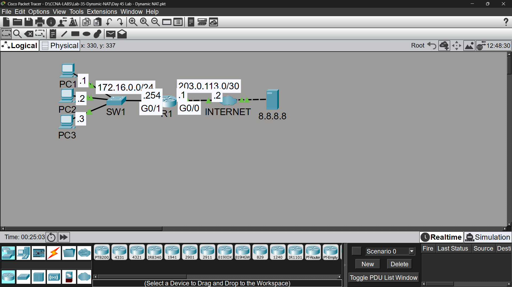

# Lab 35 - Dynamic NAT & PAT

## Objective
Configure dynamic NAT with a limited address pool, observe pool
exhaustion, then switch to PAT (NAT Overload) for scalable
address translation.

## Topology

## Commands Used

### Step 1 - Dynamic NAT Configuration

**Inside/Outside Interfaces:**
R1(config)# interface gigabitethernet0/0
R1(config-if)# ip nat outside

R1(config)# interface gigabitethernet0/1
R1(config-if)# ip nat inside

**Traffic to Translate:**
R1(config)# access-list 1 permit 172.16.0.0 0.0.0.255

**NAT Pool:**
R1(config)# ip nat pool POOL1 100.0.0.1 100.0.0.2 netmask 255.255.255.0
R1(config)# ip nat inside source list 1 pool POOL1

### Step 3 - Remove Dynamic NAT, Switch to PAT
R1# clear ip nat translation *
R1(config)# no ip nat inside source list 1 pool POOL1
R1(config)# no ip nat pool POOL1

R1(config)# ip nat inside source list 1 interface gigabitethernet0/0 overload

### Verification
R1# show ip nat translations
R1# show ip nat statistics

## Key Findings

| Question | Answer |
|----------|--------|
| PC3's ping with Dynamic NAT (2 addresses, 3 PCs)? | ❌ Failed - NAT pool exhaustion, no address available |
| Ping results after switching to PAT? | ✅ Success for all 3 PCs simultaneously |
| How does PAT allow multiple hosts to share 1 IP? | Uses different source port numbers to distinguish each session |

## NAT Translation Table (PAT Example)
| Protocol | Inside Global | Inside Local |
|----------|---------------|--------------|
| icmp | 203.0.113.1:10 | 172.16.0.2:10 |
| icmp | 203.0.113.1:13 | 172.16.0.1:13 |
| icmp | 203.0.113.1:5 | 172.16.0.3:5 |

All three PCs share the same public IP (203.0.113.1) but are distinguished by unique port numbers.

## Key Concepts Learned
- Dynamic NAT maps private IPs to a pool of public IPs - limited by pool size
- Pool exhaustion occurs when more hosts need translation than available addresses
- PAT (Port Address Translation / NAT Overload) allows many-to-one mapping using ports
- PAT is the most common NAT type used in home/small business routers
- 'overload' keyword enables PAT using a single interface's IP address
- PAT scales far better than dynamic NAT since ports provide thousands of possible sessions

## Connectivity Test
- Dynamic NAT: PC1 ✅ / PC2 ✅ / PC3 ❌ (pool exhausted)
- PAT: PC1 ✅ / PC2 ✅ / PC3 ✅ (all successful)

## Status
✅ Completed

## Notes
Part of Jeremy's IT Lab CCNA course 