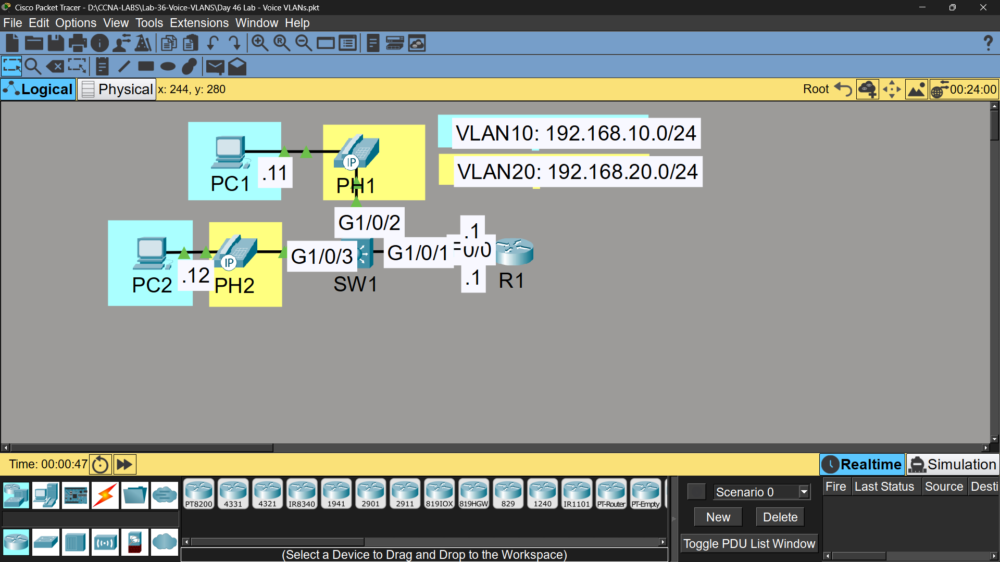

# Lab 36 - Voice VLANs

## Objective
Configure separate Data and Voice VLANs on switch ports, allowing
PCs and IP phones to share a single physical port while remaining
in different VLANs.

## Topology

## Commands Used

### Step 1 - Access Ports with Voice VLAN on SW1
=SW1(config)# interface range gigabitethernet1/0/2 - 3
SW1(config-if-range)# switchport mode access
SW1(config-if-range)# switchport access vlan 10
SW1(config-if-range)# switchport voice vlan 20

**Trunk to R1:**
SW1(config)# interface gigabitethernet1/0/1
SW1(config-if)# switchport mode trunk
SW1(config-if)# switchport trunk allowed vlan 10,20

### Step 2 - ROAS on R1
R1(config)# interface fastethernet0/0
R1(config-if)# no shutdown

R1(config)# interface fastethernet0/0.1
R1(config-subif)# encapsulation dot1Q 10
R1(config-subif)# ip address 192.168.10.1 255.255.255.0

R1(config)# interface fastethernet0/0.2
R1(config-subif)# encapsulation dot1Q 20
R1(config-subif)# ip address 192.168.20.1 255.255.255.0

### Verification
SW1# show interfaces gigabitethernet1/0/2 switchport
SW1# show vlan brief

## Key Findings

| Question | Answer |
|----------|--------|
| Is PC-to-PC traffic (VLAN10) tagged? | ❌ No - access VLAN traffic is untagged on the access port |
| Is Phone-to-Phone traffic (VLAN20) tagged? | ✅ Yes - voice VLAN traffic is tagged even on an access port |

## Key Concepts Learned
- Voice VLAN allows a single switchport to support both a PC (data) and an IP phone (voice)
- 'switchport access vlan' sets the untagged data VLAN
- 'switchport voice vlan' sets a separate tagged VLAN for voice traffic
- IP phones typically have a built-in 3-port switch to pass PC traffic through
- Data traffic remains untagged while voice traffic is 802.1Q tagged, even on an access port
- This separation allows QoS to prioritize voice traffic over regular data

## Connectivity Test
- PC1 ping to PC2 (Data VLAN10): ✅ Success, untagged
- PH2 call to PH1 (Voice VLAN20): ✅ Success, tagged

## Status
✅ Completed

## Notes
Part of Jeremy's IT Lab CCNA course 