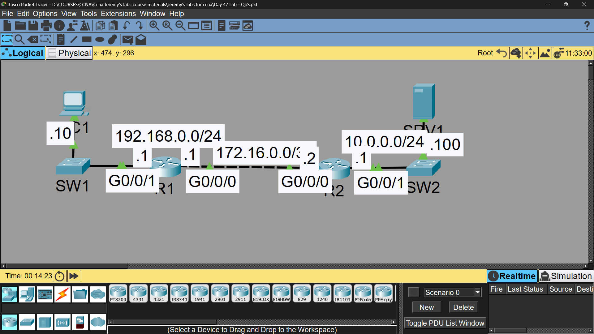

# Lab 37 - QoS (Quality of Service)

## Objective
Configure class-based QoS to classify, mark, and prioritize different
traffic types (HTTPS, HTTP, ICMP) using MQC (Modular QoS CLI).

## Note
QoS is outside the official CCNA exam scope, but included in the
portfolio to demonstrate broader networking knowledge.

## Topology

## Commands Used

### Step 1 - Define Traffic Classes
R1(config)# class-map HTTPS_MAP
R1(config-cmap)# match protocol https

R1(config)# class-map HTTP_MAP
R1(config-cmap)# match protocol http

R1(config)# class-map ICMP_MAP
R1(config-cmap)# match protocol icmp

### Step 2 - Create Policy Map (Marking & Bandwidth)
R1(config)# policy-map G0/0/0_OUT
R1(config-pmap)# class HTTPS_MAP
R1(config-pmap-c)# set ip dscp af31
R1(config-pmap-c)# priority percent 10

R1(config-pmap)# class HTTP_MAP
R1(config-pmap-c)# set ip dscp af32
R1(config-pmap-c)# bandwidth percent 10

R1(config-pmap)# class ICMP_MAP
R1(config-pmap-c)# set ip dscp cs2
R1(config-pmap-c)# bandwidth percent 5

### Step 3 - Apply Policy to Interface
R1(config)# interface gigabitethernet0/0/0
R1(config-if)# service-policy output G0/0/0_OUT

### Verification
R1# show running-config | section class-map
R1# show running-config | section policy-map
R1# show policy-map interface gigabitethernet0/0/0

## Step 4 - DSCP Markings Observed (Simulation Mode)

| Traffic Type | DSCP Marking | Queue Treatment |
|--------------|--------------|-----------------|
| ICMP (ping) | CS2 | Guaranteed 5% bandwidth |
| HTTP | AF32 | Guaranteed 10% bandwidth |
| HTTPS | AF31 | Priority queue, 10% bandwidth (low latency) |

## Key Concepts Learned
- QoS classifies, marks, and prioritizes traffic to manage bandwidth during congestion
- Class-maps define WHICH traffic to match (by protocol, ACL, etc.)
- Policy-maps define WHAT to do with matched traffic (mark, prioritize, limit)
- 'priority percent' creates a strict priority queue (best for latency-sensitive traffic like voice/video)
- 'bandwidth percent' guarantees a minimum bandwidth share without strict priority
- DSCP markings (AF, CS, EF) travel with the packet and can be honored end-to-end
- Service-policy must be applied to an interface (inbound or outbound) to take effect

## Status
✅ Completed

## Notes
Part of Jeremy's IT Lab CCNA course 
QoS is not part of the official CCNA exam blueprint but is included here to demonstrate broader practical networking knowledge.
