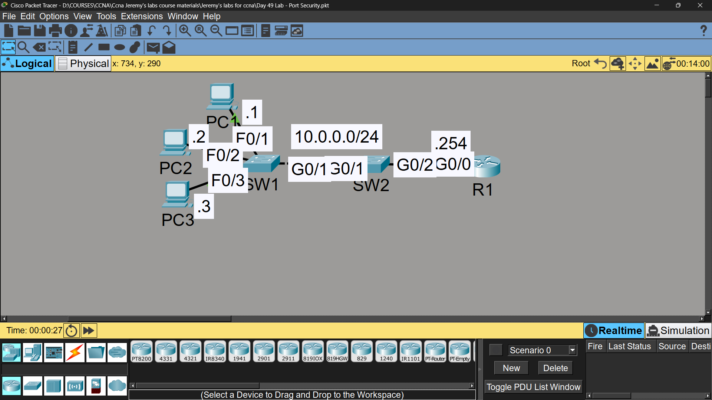

# Lab 38 - Port Security

## Objective
Configure port security with different violation modes, maximum
MAC address limits, and sticky learning to protect against
unauthorized device connections.

## Topology

## Commands Used

### SW1 - F0/1, F0/2, F0/3 (Shutdown Mode)
SW1(config)# interface fastethernet0/1
SW1(config-if)# switchport mode access
SW1(config-if)# switchport port-security
SW1(config-if)# switchport port-security violation shutdown
SW1(config-if)# switchport port-security maximum 1
SW1(config-if)# switchport port-security aging time 60
*(Repeated for F0/2 and F0/3 - sticky learning disabled by default)*

### SW2 - G0/1 (Restrict Mode)
SW2(config)# interface gigabitethernet0/1
SW2(config-if)# switchport mode access
SW2(config-if)# switchport port-security
SW2(config-if)# switchport port-security maximum 4
SW2(config-if)# switchport port-security violation restrict
SW2(config-if)# switchport port-security mac-address sticky

### Verification
SW1# show port-security interface fastethernet0/1
SW2# show port-security interface gigabitethernet0/1
SW1# show port-security address

## Violation Mode Comparison

| Switch | Interface | Violation Mode | Max MAC | Sticky | Behavior on Violation |
|--------|-----------|----------------|---------|--------|------------------------|
| SW1 | F0/1-F0/3 | Shutdown | 1 | Disabled | Port goes err-disabled, all traffic stops |
| SW2 | G0/1 | Restrict | 4 | Enabled | Violating traffic dropped, port stays up, violation counter increases |

## Testing Results

| Switch | Test | Result |
|--------|------|--------|
| SW1 | Connected 2nd device on F0/1 | Port went into **err-disabled** state, link down |
| SW2 | Connected 5th device on G0/1 | Port stayed **up**, 5th device's traffic silently dropped, violation counter incremented |

## Key Concepts Learned
- Port security limits the number of MAC addresses allowed on a port
- **Shutdown** mode: port goes err-disabled on violation (most secure, requires manual/auto recovery)
- **Restrict** mode: drops violating traffic but keeps port up, logs violation
- **Protect** mode: drops violating traffic silently, no log (not used in this lab)
- Sticky learning converts dynamically learned MACs into the running-config automatically
- Aging time controls how long a dynamically learned MAC stays in the address table
- `err-disable recovery` can be configured to automatically bring a shutdown port back up after a timer

## Status
✅ Completed

## Notes
Part of Jeremy's IT Lab CCNA course