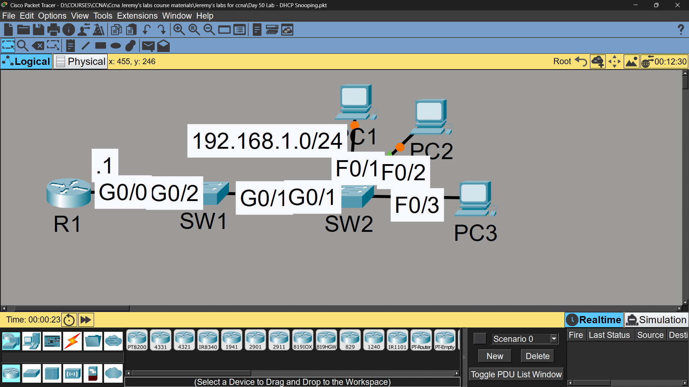

# Lab 39 - DHCP Snooping

## Objective
Configure DHCP snooping to protect the network against rogue DHCP
servers by trusting only legitimate uplink ports.

## Topology

## Commands Used

### Step 1 - DHCP Server on R1
R1(config)# ip dhcp excluded-address 192.168.1.1 192.168.1.9
R1(config)# ip dhcp pool 1
R1(dhcp-config)# network 192.168.1.0 255.255.255.0
R1(dhcp-config)# default-router 192.168.1.1

### Step 2 - DHCP Snooping on SW1 & SW2
SW1(config)# ip dhcp snooping
SW1(config)# ip dhcp snooping vlan 1
SW1(config)# no ip dhcp snooping information option
SW1(config)# interface gigabitethernet0/2
SW1(config-if)# ip dhcp snooping trust

SW2(config)# ip dhcp snooping
SW2(config)# ip dhcp snooping vlan 1
SW2(config)# no ip dhcp snooping information option
SW2(config)# interface gigabitethernet0/1
SW2(config-if)# ip dhcp snooping trust

### Step 3 - Test DHCP on PC1
PC1> ipconfig /renew

### Verification
SW1# show ip dhcp snooping
SW1# show ip dhcp snooping binding

## Key Findings

| Question | Answer |
|----------|--------|
| Did PC1 receive an IP address? | ✅ Yes |
| Why did it work? | Because Option 82 (DHCP relay information) was disabled with 'no ip dhcp snooping information option'. Without this command, SW2 would insert Option 82 into the DHCP packet, and since the packet arrives on an untrusted port at the next switch, it would be dropped |

## Key Concepts Learned
- DHCP snooping filters DHCP messages on a per-port basis (trusted vs untrusted)
- Only trusted ports (usually uplinks to the DHCP server) can send DHCP server responses (Offer/Ack)
- Untrusted ports (host-facing) can only send DHCP client requests
- Option 82 adds switch/port info to DHCP packets for relay tracking - can cause packets to be dropped on untrusted ports of the next switch if not disabled in multi-switch topologies
- DHCP snooping protects against rogue DHCP servers handing out malicious IP/gateway/DNS info
- A DHCP snooping binding table tracks legitimate IP-to-MAC-to-port mappings (used later by DAI and IP Source Guard)

## Connectivity Test
- PC1 DHCP renew: ✅ Success - received IP from R1's pool

## Status
✅ Completed

## Notes
Part of Jeremy's IT Lab CCNA course