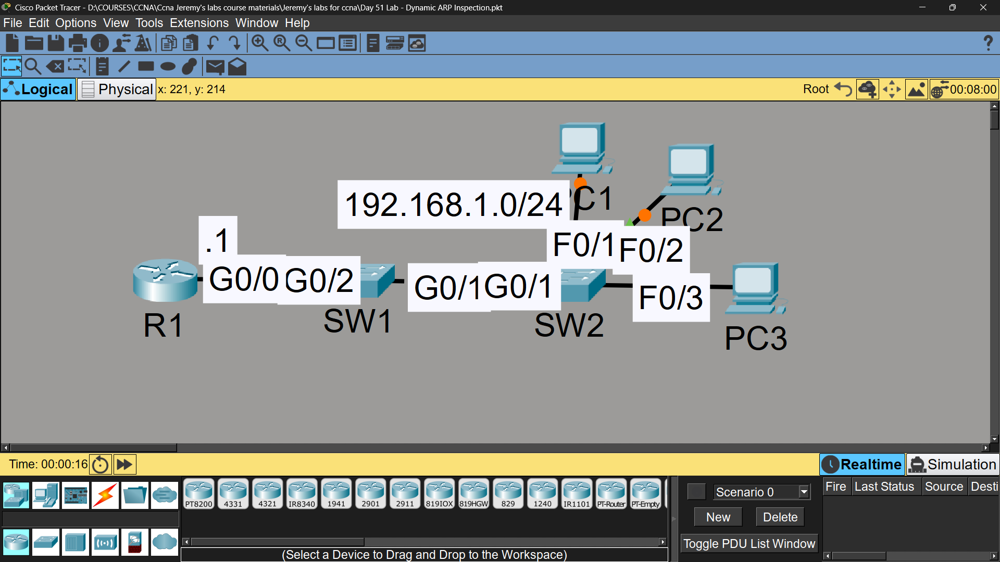
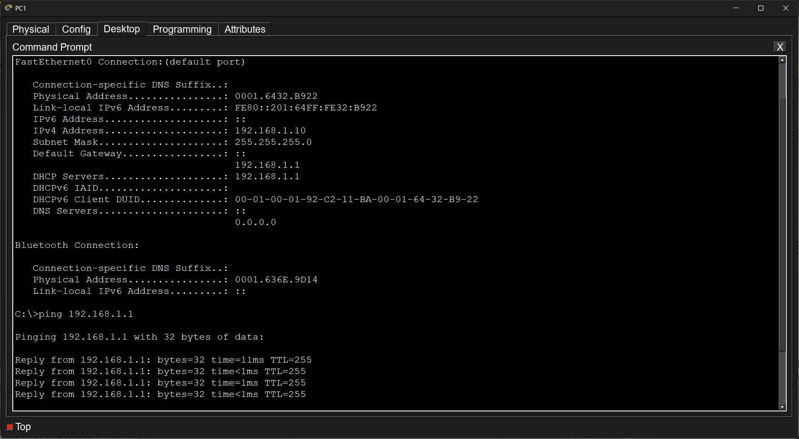

# Lab 40 - Dynamic ARP Inspection (DAI)

## Objective
Configure DHCP snooping as a prerequisite, then enable Dynamic ARP
Inspection to protect the network against ARP spoofing/poisoning attacks.

## Topology

## Commands Used

### Step 1 - DHCP Server on R1
R1(config)# ip dhcp excluded-address 192.168.1.1 192.168.1.9
R1(config)# ip dhcp pool POOL1
R1(dhcp-config)# default-router 192.168.1.1
R1(dhcp-config)# network 192.168.1.0 255.255.255.0

### Step 2 - DHCP Snooping on SW1 & SW2
SW1(config)# ip dhcp snooping
SW1(config)# ip dhcp snooping vlan 1
SW1(config)# interface gigabitethernet0/2
SW1(config-if)# ip dhcp snooping trust
SW1(config)# no ip dhcp snooping information option

SW2(config)# ip dhcp snooping
SW2(config)# ip dhcp snooping vlan 1
SW2(config)# no ip dhcp snooping information option
SW2(config)# interface gigabitethernet0/1
SW2(config-if)# ip dhcp snooping trust

### Step 3 - Dynamic ARP Inspection (DAI)
SW1(config)# ip arp inspection vlan 1
SW1(config)# interface range gigabitethernet0/1 - 2
SW1(config-if-range)# ip arp inspection trust
SW1(config)# ip arp inspection validate dst-mac src-mac ip

SW2(config)# ip arp inspection vlan 1
SW2(config)# interface gigabitethernet0/1
SW2(config-if)# ip arp inspection trust
SW2(config)# ip arp inspection validate dst-mac src-mac ip

### Verification
SW1# show ip arp inspection
SW1# show ip arp inspection interfaces
SW1# show ip dhcp snooping binding
#### PING TEST :

## Key Concepts Learned
- DAI validates ARP packets against the DHCP snooping binding table (IP-to-MAC mapping)
- DAI **requires DHCP snooping** to be enabled first - it relies on the same binding table
- Untrusted ports have all ARP packets inspected; trusted ports (uplinks) bypass inspection
- Invalid ARP packets (spoofed IP/MAC) are dropped, preventing ARP poisoning/MITM attacks
- Additional validation checks:
  - **src-mac**: validates sender MAC in Ethernet header matches ARP body
  - **dst-mac**: validates target MAC in Ethernet header matches ARP body (for replies)
  - **ip**: validates sender/target IP addresses are valid (not 0.0.0.0, broadcast, or multicast)
- Trust ports should only be configured on links connecting to other switches/routers, never end hosts

## Security Layer Relationship
DHCP Snooping (builds binding table)
         ↓
Dynamic ARP Inspection (validates ARP using that table)

## Status
✅ Completed

## Notes
Part of Jeremy's IT Lab CCNA course 