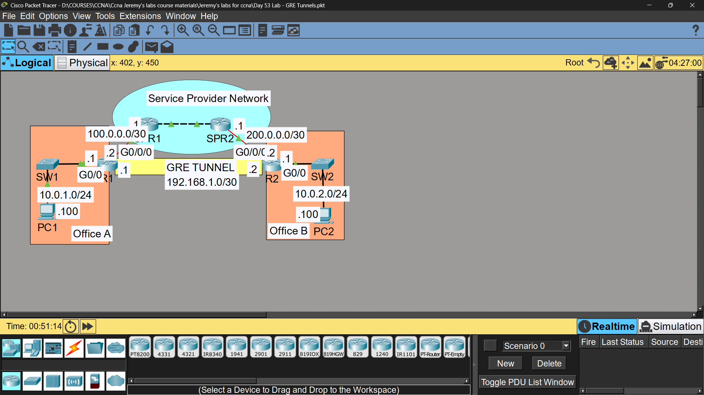
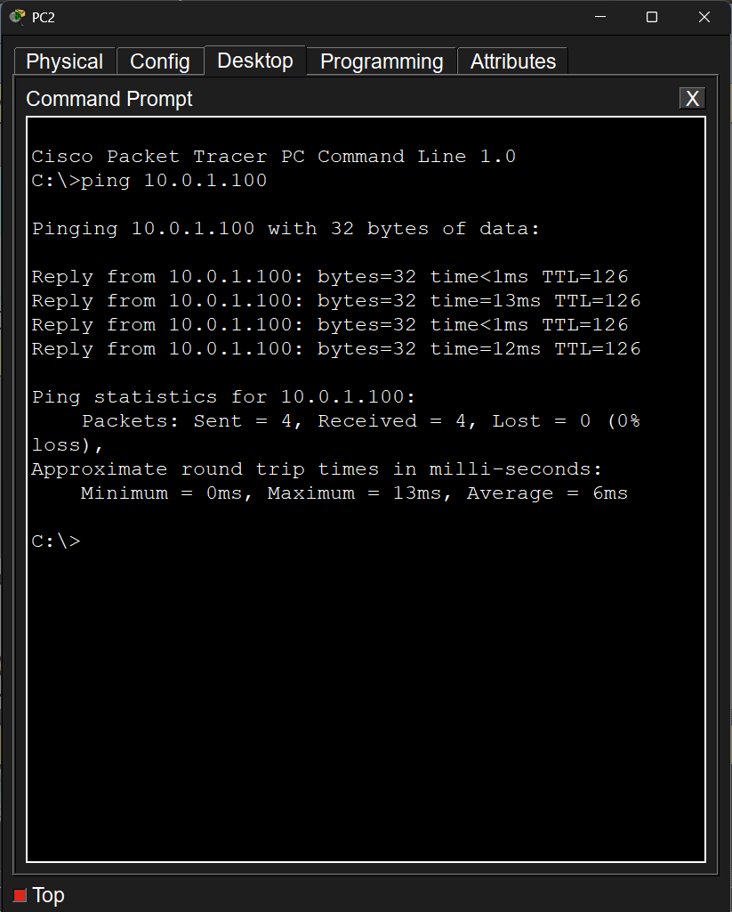

# Lab 41 - GRE Tunneling

## Objective
Configure a GRE tunnel between two routers across a public network,
then route OSPF traffic through the tunnel to connect two private LANs.

## Note
GRE Tunneling is not part of the official CCNA exam blueprint, but is
included here to demonstrate broader WAN networking knowledge.

## Topology

## Commands Used

### Step 1 - GRE Tunnel Configuration
R1(config)# interface tunnel 1
R1(config-if)# tunnel source gigabitethernet0/0/0
R1(config-if)# tunnel destination 200.0.0.2
R1(config-if)# ip address 192.168.1.1 255.255.255.252

R2(config)# interface tunnel 10
R2(config-if)# tunnel source gigabitethernet0/0/0
R2(config-if)# tunnel destination 100.0.0.2
R2(config-if)# ip address 192.168.1.2 255.255.255.252

### Step 2 - OSPF Over the Tunnel
R1(config)# router ospf 1
R1(config-router)# network 10.0.1.0 0.0.0.255 area 0
R1(config-router)# network 192.168.1.0 0.0.0.255 area 0
R1(config-router)# passive-interface gigabitethernet0/0

R2(config)# router ospf 1
R2(config-router)# network 192.168.1.0 0.0.0.255 area 0
R2(config-router)# network 10.0.2.0 0.0.0.255 area 0
R2(config-router)# passive-interface gigabitethernet0/0

### Verification
R1# show interfaces tunnel 1
R1# show ip ospf neighbor
R1# show ip route
PC1> ping [PC2 IP]

## Key Concepts Learned
- GRE (Generic Routing Encapsulation) creates a virtual point-to-point link across a public/untrusted network
- Tunnel source/destination use the routers' real (public-facing) IP addresses
- The tunnel interface gets its own private IP address, used for routing between sites
- Routing protocols (like OSPF) can run over the tunnel just like a normal link
- GRE by itself does NOT encrypt traffic - it only encapsulates it (often paired with IPsec for security)
- Passive-interface is used on LAN-facing interfaces to prevent unnecessary OSPF hellos toward end hosts

## Connectivity Test
- OSPF neighbor adjacency over tunnel: ✅ FULL
- PC1 ping to PC2 (via GRE tunnel): ✅ Success

## Status
✅ Completed

## Notes
Part of Jeremy's IT Lab CCNA course 
GRE Tunneling is not part of the official CCNA exam blueprint but is
included here to demonstrate broader practical networking knowledge.